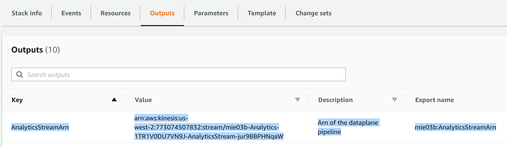

# Developer's Guide for building applications on the Media Insights Engine

This guide explains how to build applications on the [Media Insights Engine](https://github.com/awslabs/aws-media-insights-engine) framework.

Join our Gitter chat at [https://gitter.im/awslabs/aws-media-insights-engine](https://gitter.im/awslabs/aws-media-insights-engine). This public chat forum was created to foster communication between MIE developers worldwide.

[](https://gitter.im/awslabs/aws-media-insights-engine)

**Contents**

[1. Overview](#1-overview)

[2. Prerequisites](#2-prerequisites)

[3. Building the MIE framework from source code](#3-building-the-mie-framework-from-source-code)

[4. Implementing a new operator](#4-implementing-a-new-operator-in-mie)
  - [Step 1: Write operator Lambda functions](#step-1-write-operator-lambda-functions)
  - [Step 2: Add your operator to the MIE operator library](#step-2-add-your-operator-to-the-mie-operator-library)
  - [Step 3: Add your operator to a workflow](#step-3-add-your-operator-to-a-workflow)
  - [Step 4: Update the build script to deploy your operator to AWS Lambda](#step-4-update-the-build-script-to-deploy-your-operator-to-aws-lambda)
  - [Step 5: Deploy your Custom Operator](#step-5-deploy-your-custom-build)
  - [Step 6: Test your new workflow and operator](#step-6-test-your-new-workflow-and-operator)

[5. Implementing a new data stream consumer](#5-implementing-a-new-data-stream-consumer)

[6. Signing API Requests](#6-signing-api-requests)

[7. API Documentation](#7-api-documentation)

[8. Troubleshooting](#8-troubleshooting)

[9. Glossary](#9-glossary)

## 1. Overview
This guide describes how to build MIE from source code and how to build applications that use MIE as a back-end for executing multimedia workflows. This guide is intended for software developers who have experience working with the AWS Cloud.

## 2. Prerequisites

You must have the following build tools in order to build MIE:

* AWS CLI - configured
* Docker - installed and running

## 3. Building the MIE framework from source code

Run the following commands to build and deploy MIE Cloud Formation templates from scratch. 
Define values for `MIE_STACK_NAME` and `REGION` first.

```
MIE_STACK_NAME=[YOUR STACK NAME]
REGION=[YOUR REGION]
```

Clone the remote repository and go to the deployment directory

```
git clone https://github.com/awslabs/aws-media-insights-engine
cd aws-media-insights-engine
cd deployment
```

Define values for `VERSION`, `DATETIME`, `DIST_OUTPUT_BUCKET` and `TEMPLATE_OUTPUT_BUCKET`

```
VERSION=1.0.0
DATETIME=$(date '+%s')
DIST_OUTPUT_BUCKET=media-insights-engine-$DATETIME-dist
TEMPLATE_OUTPUT_BUCKET=media-insights-engine-$DATETIME
```
Create the S3 buckets that will be used by the build script

```
aws s3 mb s3://$DIST_OUTPUT_BUCKET-$REGION --region $REGION
aws s3 mb s3://$TEMPLATE_OUTPUT_BUCKET --region $REGION
```

Execute the build script

```
./build-s3-dist.sh --template-bucket $TEMPLATE_OUTPUT_BUCKET --code-bucket $DIST_OUTPUT_BUCKET --version $VERSION --region $REGION | tee >( grep TEMPLATE >template )
```

Create the Cloudformation stack
```
TEMPLATE=$(cat template | cut -f 2 -d "'")
rm -f template 
aws cloudformation create-stack --stack-name $MIE_STACK_NAME --template-url $TEMPLATE --region $REGION --parameters ParameterKey=DeployTestResources,ParameterValue=true ParameterKey=EnableXrayTrace,ParameterValue=true ParameterKey=MaxConcurrentWorkflows,ParameterValue=10 ParameterKey=DeployAnalyticsPipeline,ParameterValue=true --capabilities CAPABILITY_IAM CAPABILITY_NAMED_IAM CAPABILITY_AUTO_EXPAND --profile default --disable-rollback
```

After the stack deploys then remove the temporary build bucket like this:

```
aws s3 rb s3://$DIST_OUTPUT_BUCKET-$REGION --region $REGION --profile default --force
```

## 4. Implementing a new Operator in MIE

Operators are Lambda functions that:

* derive new media objects from input media and/or
* generate metadata by analyzing input media.

Operators run as part of an MIE workflow. Workflows are [AWS Step Functions](https://aws.amazon.com/step-functions/) that define the order in which operators run.

Operators can be _synchronous_ or _asynchronous_.  Synchronous operators start an  analysis (or transformation) job and get its result in a single Lambda function. Asynchronous operators use separate Lambda functions to start jobs and get their results. Typically, asynchronous operators run for several minutes.

Operator inputs can include a list of media, metadata and the user-defined workflow and/or operator configurations.

Operator outputs include the run status, and S3 locations for the newly derived media and metadata objects saved in S3. These outputs get passed to other operators in downstream workflow stages.

Operators should interact with the MIE data persistence layer via the `MediaInsightsEngineLambdaHelper`, which is located under [source/lib/MediaInsightsEngineLambdaHelper/](source/lib/MediaInsightsEngineLambdaHelper/MediaInsightsEngineLambdaHelper/__init__.py).

### Step 1: Write operator Lambda functions
***(Time to complete: >1 hour)***

Operators live under `source/operators`.  Create a new folder there for your new operator. Copy `source/operators/rekognition/generic_data_lookup.py` to a new directory and change it to do what you want.

The MIE Helper library must be used inside an operator to interact with the control plane and data plane. This library lives under `lib/MediaInsightsEngineLambdaHelper/`.

#### Using the MIE Helper library

Instantiate the helper like this:

```
from MediaInsightsEngineLambdaHelper import OutputHelper
output_object = OutputHelper("<OPERATOR_NAME>")
```

#### Get Asset and Workflow IDs

In order to make it easier to find results and know the provenance of data, operators should save the files that they generate to a directory path that is unique to the workflow execution ID and asset ID (e.g. `‘s3//’ + dataplane_bucket + ’/private/assets/' + asset_id + "/workflows/" + workflow_id + "/"`). The workflow and asset IDs can be obtained from the Lambda's entry point event object, like this:

```
# Lambda function entrypoint:
def lambda_handler(event, context):
    workflow_id = str(event["WorkflowExecutionId"])
    asset_id = event['AssetId']
```

#### Get input Media Objects

Media objects are passed using their location in S3.  Use the `boto3` S3 client access them from S3 using the locations specified in the Lambda's entrypoint event object:

```
def lambda_handler(event, context):
    if "Video" in event["Input"]["Media"]:
        s3bucket = event["Input"]["Media"]["Video"]["S3Bucket"]
        s3key = event["Input"]["Media"]["Video"]["S3Key"]
    elif "Image" in event["Input"]["Media"]:
        s3bucket = event["Input"]["Media"]["Image"]["S3Bucket"]
        s3key = event["Input"]["Media"]["Image"]["S3Key"]
```

#### Get operator configuration input

Operator configurations can be accessed from the "Configuration" attribute in the Lambda's entrypoint event object. For example, here's how the face search operator gets the user-specified face collection id:

```
collection_id = event["Configuration"]["CollectionId"]
```

#### Write data to downstream operators

Metadata derived by an operator can be passed as input to the next stage in a workflow by adding specified data to the operator's `output_object`. Do this with the `add_workflow_metadata` function in the OutputHelper, as shown below:

***The values for attributes must be strings.***
***The values for attributes must not be empty strings.***

```
from MediaInsightsEngineLambdaHelper import OutputHelper
output_object = OutputHelper(<OPERATOR_NAME>)

def lambda_handler(event, context):
    ...
    # Passing MyData objects to downstream operators 
    output_object.add_workflow_metadata(MyData1=my_data_1)
    output_object.add_workflow_metadata(MyData2=my_data_2)
    # Multiple key value pairs can also be specified as a list, like this:
    output_object.add_workflow_metadata(MyData3=my_data_3, MyData4=my_data_4)
    ...
    return output_object.return_output_object()
```        

#### Read data from upstream operators

Metadata that was output by upstream operators can be accessed from the Lambda's entrypoint event object, like this:

```
my_data_1 = event["Input"]["MetaData"]["MyData1"]
```

#### Store media metadata to the data plane

Use `store_asset_metadata()` to store results. For paged results, call that function for each page.

```
from MediaInsightsEngineLambdaHelper import DataPlane
dataplane = DataPlane()
metadata_upload = dataplane.store_asset_metadata(asset_id, operator_name, workflow_id, response)
```

#### Store media objects to the data plane

Operators can derive new media objects. For example, the Transcribe operator derives a new text object from an input audio object. Save new media objects with `add_media_object()`, like this:

```
from MediaInsightsEngineLambdaHelper import MediaInsightsOperationHelper
operator_object = MediaInsightsOperationHelper(event)
operator_object.add_media_object(my_media_type, bucket, key)
```

The `my_media_type` variable should be "Video", "Audio", or "Text".

#### Retrieve media objects from the data plane

```
from MediaInsightsEngineLambdaHelper import MediaInsightsOperationHelper
operator_object = MediaInsightsOperationHelper(event)
bucket = operator_object.input["Media"][my_media_type]["S3Bucket"]
key = operator_object.input["Media"][my_media_type]["S3Key"]
s3_response = s3.get_object(Bucket=bucket, Key=key)
```

Again, the `my_media_type` variable should be "Video", "Audio", or "Text".

### Step 2: Add your operator to the MIE operator library
***(Time to complete: 30 minutes)***

This step involves editing the CloudFormation script for deploying the MIE operator library, located at `source/operators/operator-library.yaml`. You need to add new entries for your operator under the following sections:

* `Lambda Functions`
* `IAM Roles`
* `Register as operators in the control plane`
* `Export operator names as outputs`

This step involves editing the CloudFormation script for deploying the MIE operator library, located at [`source/operators/operator-library.yaml`](source/operators/operator-library.yaml).

#### Create the IAM Role resource

Create a CloudFormation IAM resource that will be used to give your Lambda function the appropriate permissions. MIE operators need `AWSLambdaBasicExecutionRole` plus policies for any other AWS resource and services accessed by the Lambda function.

#### Create Lambda Function resource

Create a CloudFormation `Lambda::Function` resource for your Operator Lambda function.  If your Operator is asynchronous, make sure to also register your monitoring Lambda function.

#### Create the MIE Operator resource using your Lambda function(s)

The MIE Operator custom resource has the following attributes:

```
Type: Custom:CustomResource
Properties:
  ServiceToken: !Ref WorkflowCustomResourceArn
  ResourceType:
    ResourceType
  Name: 
    Name
  Type:
    Type
  Configuration: 
    Configuration
  StartLambdaArn:
    StartLambdaArn
  MonitorLambdaArn:
    MonitorLambdaArn
  StateMachineExecutionRoleArn: !GetAtt StepFunctionRole.Arn
```

***ResourceType***

* Specify the type of resource: `"Operator"`, `"Workflow"`, or `"Stage"`

***Name***

* Specify the name of your Operator

***Type***

* Specify whether your operator is `Sync` or `Async`

***Configuration***

* Specify the `MediaType` and `Enabled` fields and add any other configurations needed

***StartLambdaArn***

* Specify the ARN of the Lambda function to start your Operator

***MonitorLambdaArn***

* If your operator is asynchronous, specify the ARN of the monitoring Lambda function

#### Export your Operator name as an output

Export your operator as an output like this:
```
  MyOperation:
    Description: "Operation name of MyOperation"
    Value: !GetAtt MyOperation.Name
    Export:
      Name: !Join [":", [!Ref "AWS::StackName", MyOperation]]
```

### Step 3: Add your operator to a workflow
***(Time to complete: 10 minutes)***

It's easiest to create a new workflow by copying end editing one of the existing workflows in the `cloudformation/` directory. Edit `cloudformation/aws-content-analysis-video-workflow.yaml` and add your operator under `Resources --> defaultVideoStage --> Operations`*

A workflow consists of one or more stages. Operators in the same stage will run at the same time. Stages will run sequentially, one at a time. The workflow defines the order in which stages sequentially run.

### Step 4: Update the build script to deploy your operator to AWS Lambda
***(Time to complete: 5 minutes)***

Update the "`Make lambda package`" section in [`build-s3-dist.sh`](deployment/build-s3-dist.sh) to zip your operator's Lambda function(s) into the regional distribution directory, like this:

```
# Add operator code to a zip package for AWS Lambda
zip my_operator.zip my_operator.py
# Copy that zip to the regional distribution directory.
cp "./dist/my_operator.zip" "$regional_dist_dir/ "
```

### Step 5: Deploy your custom build

Run the build script to generate cloud formation templates then deploy them as described in the [README](https://github.com/awslabs/aws-media-insights/blob/old_dev_webapp_merge/README.md#build-from-source)

### Step 6: Test your new workflow and operator

To test workflows and operators, you will submit requests to the workflow API endpoint using AWS_IAM authorization. Tools like [Postman](README.md#Security) (described in the [README](README.md#Security)) and [awscurl](https://github.com/okigan/awscurl) simplify AWS_IAM authorization. The following examples assume your AWS access key and secret key are set up as required by `awscurl`:

*Sample command to list all available workflows:*

```
awscurl "$WORKFLOW_API_ENDPOINT"/workflow | cut -f 2 -d "'" | jq '.[].Name'
```

*Sample command to list all stages in a workflow:*

```
WORKFLOW_NAME="CasImageWorkflow"
awscurl "$WORKFLOW_API_ENDPOINT"/workflow/"$WORKFLOW_NAME" | cut -f 2 -d "'" | jq -c '.Stages | .[].Name'
```

*Sample command to get the workflow configuration for a stage:*

```
WORKFLOW_NAME="CasImageWorkflow"
STAGE_NAME="RekognitionStage"
awscurl "$WORKFLOW_API_ENDPOINT"/workflow/"$WORKFLOW_NAME" | cut -f 2 -d "'" | jq -c '.Stages."$STAGE_NAME".Configuration'
```

*Sample command to run a workflow with the default configuration:*

```
WORKFLOW_NAME="CasImageWorkflow"
aws s3 cp test_image.jpg s3://"$DATAPLANE_BUCKET"/ 
awscurl -X POST --data '{"Name":"$WORKFLOW_NAME", "Input":{"Media":{"Image":{"S3Bucket":"'$DATAPLANE_BUCKET'","S3Key":"test_image.jpg"}}}}' $WORKFLOW_API_ENDPOINT/workflow/execution 
```

*Sample command to run a workflow with a non-default configuration:*

```
WORKFLOW_NAME="CasImageWorkflow"
CONFIGURATION='{"RekognitionStage":{"faceDetectionImage":{"MediaType":"Image","Enabled":false},"celebrityRecognitionImage":{"MediaType":"Image","Enabled":false},"faceSearchImage":{"MediaType":"Image","Enabled":false},"contentModerationImage":{"MediaType":"Image","Enabled":false},"labelDetectionImage":{"MediaType":"Image","Enabled":false}}}'
aws s3 cp test_image.jpg s3://"$DATAPLANE_BUCKET"/ 
awscurl -X POST --data '{"Name":"'$WORKFLOW_NAME'", "Configuration":'$CONFIGURATION', "Input":{"Media":{"Image":{"S3Bucket":"'$DATAPLANE_BUCKET'","S3Key":"test_image.jpg"}}}}' $WORKFLOW_API_ENDPOINT/workflow/execution
```

#### Monitor your test

You can monitor workflows with the following logs:

* Your operator lambda. To find this log, search the Lambda functions for your operator name.
* The data plane API lambda. To find this log, search Lambda functions for "MediaInsightsDataplaneApiStack".

#### Validate metadata in the data plane

When your operator finishes successfully, then you can refer to data saved from the `Dataplane.store_asset_metadata()` function in the `DataplaneTable` in Amazon DynamoDB.

# 5. Implementing a new data stream consumer

The data plane stores each item as an object in Amazon S3 and stores their S3 object identifier in DynamoDB. However, many application scenarios involve data access patterns that require capabilities beyond those provided by DynamoDB and S3. For example, you might need Amazon Elasticsearch Service (Amazon ES) to support interactive analytics, Amazon SNS may be needed to provide real-time messaging and notifications, or Amazon Quicksight to support analytical reporting over big datasets.

The data plane provides a change-data-capture (CDC) stream from DynamoDB to communicate media analysis data to stream consumers where ETL tasks can transform and load raw data to the downstream data stores that support end-user applications. This CDC stream is provided as a Kinesis Data Stream. The ARN for this is provided as an output called `AnalyticsStreamArn` in the base MIE CloudFormation stack, as shown below:



For more information about how to implement Kinesis Data Stream consumers in MIE, refer to the [MIE demo application](https://github.com/awslabs/aws-media-insights/blob/master/README.md#advanced-usage), which includes a data stream consumer that feeds Amazon ES.

# 6. Signing API Requests

The MIE APIs in Amazon API Gateway require that you authenticate every request with the Signature Version 4 signing process. The following two example programs written in Python illustrate how to submit GET and POST requests to the MIE workflow API with Signature Version 4 signing:

* [sigv4_post_sample.py](docs/sigv4_post_sample.py) shows how to start the `CasImageWorkflow` using a Sigv4 signed request to the workflow execution API
* [sigv4_get_sample.py](docs/sigv4_get_sample.py) shows how to list all workflows using a Sigv4 signed request to the workflow execution API

# 7. API Documentation

## Summary:
* Data plane API
  * [POST /create](#POST-create)
  * [POST /download](#POST-download)
  * [GET /mediapath/{asset_id}/{workflow_id}](#GET-mediapathasset_idworkflow_id)
  * [GET /metadata](#GET-metadata)
  * [GET /metadata/{asset_id}](#GET-metadataasset_id)
  * [POST /metadata/{asset_id}](#POST-metadataasset_id)
  * [DELETE /metadata/{asset_id}](#DELETE-metadataasset_id)
  * [GET /metadata/{asset_id}/{operator_name}](#GET-metadataasset_idoperator_name)
  * [DELETE /metadata/{asset_id}/{operator_name}](#DELETE-metadataasset_idoperator_name)
  * [POST /upload](#POST-upload)
  * [GET /version](#GET-version)
* Workflow (control plane) API
  * [POST /system/configuration](#POST-systemconfiguration)
  * [GET /system/configuration](#GET-systemconfiguration)
  * [POST /workflow/operation](#POST-workflowoperation)
  * [GET /workflow/operation](#GET-workflowoperation)
  * [GET /workflow/operation/{Name}](#GET-workflowoperationName)
  * [DELETE /workflow/operation/{Name}](#DELETE-workflowoperationName)
  * [POST /workflow/stage](#POST-workflowstage)
  * [GET /workflow/stage](#GET-workflowstage)
  * [GET /workflow/stage/{Name}](#GET-workflowstageName)
  * [DELETE /workflow/stage/{Name}](#DELETE-workflowstageName)
  * [POST /workflow](#POST-workflow)
  * [PUT /workflow](#PUT-workflow)
  * [GET /workflow](#GET-workflow)
  * [GET /workflow/list/operation/{OperatorName}](#GET-workflowlistoperationOperatorName)
  * [GET /workflow/list/stage/{StageName}](#GET-workflowliststageStageName)
  * [GET /workflow/{Name}](#GET-workflowName)
  * [GET /workflow/configuration/{Name}](#GET-workflowconfigurationName)
  * [DELETE /workflow/{Name}](#DELETE-workflowName)
  * [POST /workflow/execution](#POST-workflowexecution)
  * [PUT /workflow/execution/{Id}](#PUT-workflowexecutionId)
  * [GET /workflow/execution](#GET-workflowexecution)
  * [GET /workflow/execution/status/{Status}](#GET-workflowexecutionstatusStatus)
  * [GET /workflow/execution/asset/{AssetId}](#GET-workflowexecutionassetAssetId)
  * [GET /workflow/execution/{Id}](#GET-workflowexecutionId)
  * [DELETE /workflow/execution/{Id}](#DELETE-workflowexecutionId)
  * [POST /service/transcribe/get_vocabulary](#POST-servicetranscribeget_vocabulary)
  * [POST /service/transcribe/download_vocabulary](#POST-servicetranscribedownload_vocabulary)
  * [GET /service/transcribe/list_vocabularies](#GET-servicetranscribelist_vocabularies)
  * [POST /service/transcribe/delete_vocabulary](#POST-servicetranscribedelete_vocabulary)
  * [POST /service/transcribe/create_vocabulary](#POST-servicetranscribecreate_vocabulary)
  * [POST /service/translate/get_terminology](#POST-servicetranslateget_terminology)
  * [POST /service/translate/download_terminology](#POST-servicetranslatedownload_terminology)
  * [GET /service/translate/list_terminologies](#GET-servicetranslatelist_terminologies)
  * [POST /service/translate/delete_terminology](#POST-servicetranslatedelete_terminology)
  * [POST /service/translate/create_terminology](#POST-servicetranslatecreate_terminology)
  * [POST /service/translate/get_parallel_data](#POST-servicetranslateget_parallel_data)
  * [POST /service/translate/download_parallel_data](#POST-servicetranslatedownload_parallel_data)
  * [GET /service/translate/list_parallel_data](#GET-servicetranslatelist_parallel_data)
  * [POST /service/translate/delete_parallel_data](#POST-servicetranslatedelete_parallel_data)
  * [POST /service/translate/create_parallel_data](#POST-servicetranslatecreate_parallel_data)
  * [GET /version](#GET-version)

## Data plane API

#### `POST /create`

Create an asset in the data plane from a json input composed of the input key and bucket of the object.

Body:

```
{
  "Input": {
    "S3Bucket": "{somenbucket}",
    "S3Key": "{somekey}"
  }
}
```

Returns:

* A dictionary mapping of the asset id and the new location of the media object

#### `POST /download`

Generate a pre-signed URL that can be used to download media files from S3.

Body:

```
{
  "Input": {
    "S3Bucket": "{somebucket}",
    "S3Key": "{somekey}"
  }
}
```

Returns:

* Pre-signed S3 URL for downloading files from S3 to a web application.

#### `GET /mediapath/{asset_id}/{workflow_id}`

Generate a media storage path in the dataplane S3 bucket.

Returns:

* Dictionary containing the S3 bucket and key for uploading a given asset media object to the dataplane.

#### `GET /metadata`

Returns:

* Dict containing a list of all assets by their asset_id. The list returns empty if no assets have been created.

#### `GET /metadata/{asset_id}`

Retrieve metadata for an asset.

Returns:

* All asset metadata. If the result provides a cursor then you can get the next page by specifying the cursor like this:

`GET /metadata/{asset_id}?cursor={cursor}`

#### `DELETE /metadata/{asset_id}`

Deletes an asset and all metadata from the dataplane.

Returns:

* Deletion status from dataplane.

#### `DELETE /metadata/{asset_id}/{operator_name}`

Deletes the specified operator metadata from an asset.

Returns:

* Deletion status from dataplane.

#### `POST /metadata/{asset_id}`

Add operation metadata for an asset.

Body:

```
{
  "OperatorName": "{some_operator}",
  "Results": "{json_formatted_results}"
}
```

#### `POST /upload`

Generate a pre-signed URL that can be used to upload media files to S3 from a web application.

Body:

```
{
  "OperatorName": "{some_operator}",
  "Results": "{json_formatted_results}"
}
```

#### `GET /metadata/{asset_id}/{operator_name}`

Retrieve the metadata that a specific operator created from an asset.

#### `GET /version`

Get version information.

Returns:

* A dictionary containing the version of the MIE framework and the version of the dataplane API. Since it is possible for the MIE framework to be released without any API changes, these two versions can be different. The MIE framework and its APIs are versioned according to [Semantic Versioning](https://semver.org) rules. Under this scheme, version numbers and the way they change convey meaning about backwards compatibility.

  For example, if the MIE framework was version [v2.0.4](https://github.com/awslabs/aws-media-insights-engine/releases/tag/v2.0.4) and the workflow API was version 2.0.0, then this would return the following response:

  ```
  b'{"ApiVersion":"2.0.0","FrameworkVersion":"v2.0.4"}'
  ```


## Workflow API

#### `POST /system/configuration`

Add a new system configuration parameter or update an existing MIE system configuration parameter.

Body:

```
{
  "Name": "ParameterName",
  "Value": "ParameterValue"
}
```

Supported parameters:

* ***MaxConcurrentWorkflows*** - Sets the maximum number of workflows that are allowed to run concurrently. Any new workflows that are added after MaxConcurrentWorkflows is reached are placed on a queue until capacity is freed by completing workflows. Use this to help avoid throttling in service API calls from workflow operators. This setting is checked each time the WorkflowSchedulerLambda is run and may take up to 60 seconds to take effect.

Returns: 

* Nothing

Raises:

* 200: The system configuration was set successfully
* 400: Bad Request
* 500: Internal server error - an input value is not valid

#### `GET /system/configuration`

Get the current MIE system configuration.

Returns:

* A list of dictionary containing the current MIE system configuration key-value pairs.

Raises:

* 200: The system configuration was returned successfully
* 500: Internal server error

#### `POST /workflow`

Create a workflow from a list of existing stages.
  
A workflow is a pipeline of stages that are started sequentially to transform and extract metadata for a set of MediaType objects. Each stage must contain either a “Next” key indicating the next stage to run or and “End” key indicating it is the last stage.

Body:

```
{
  "Name": string,
  "StartAt": string - name of starting stage,
  "Stages": {
    "stage-name": {
        "Next": "string - name of next stage"
    },
    ...,
    "stage-name": {
        "End": true
    }
  }
}
```

Returns:

* A dictionary mapping keys to the corresponding workflow created including the AWS resources used to run each stage.

Raises:

* 200: The workflow was created successfully
* 400: Bad Request - one of the input stages was not found or was invalid
* 500: Internal server error

#### `GET /workflow`

List all workflow definitions.

Returns:

* A list of workflow definitions.

Raises:
* 200: All workflows returned successfully
* 500: Internal server error

#### `GET /workflow/configuration/{Name}`

Get a workflow configuration object by name.

Returns:

* A dictionary containing the workflow configuration.

Raises:
* 200: All workflows returned successfully
* 404: Not found
* 500: Internal server error

#### `POST /workflow/execution`

Run a workflow.
  
The Body contains the name of the workflow to run, at least one input media type within the media object. A dictionary of stage configuration objects can be passed in to override the default configuration of the operations within the stages.

Body:  

```
{
"Name":"Default",
"Input":{
  "Media":{
    "Video":{  <-- This can also be "Image"
      "S3Bucket":"___",
      "S3Key":"___"
    }
  }
},
"Configuration": {
  "stage-name": {
    "Operations": {
      "SplitAudio": {
        "Enabled": True,
        "MediaTypes": {
          "Video": True/False,
          "Audio": True/False,
          "Frame": True/False
        }
     },
   },
 }
 ...
}
```

Returns:

* A dictionary describing the workflow execution properties and the `WorkflowExecutionId` that can be used as the `Id` in `/workflow/execution/{Id}` API requests.

Raises:

* 200: The workflow run was created successfully
* 400: Bad Request - the input workflow was not found or was not valid
* 500: Internal server error

#### `GET /workflow/execution`

List all workflow executions.

Returns:

* A list of workflow runs

Raises:

* 200: List returned successfully
* 500: Internal server error

#### `PUT /workflow/execution/{Id}`

Resume a paused workflow. 

Workflow executions will pause when they encounter a WaitOperation. The WaitOperation is in the MIE operator library and is often used in workflows that need to wait for user input.

Returns:


#### `GET /workflow/execution/asset/{AssetId}`

Get workflow executions by AssetId.

Returns:

* A list of dictionaries containing the workflow runs matching the AssetId

Raises:

* 200: List returned successfully
* 404: Not found
* 500: Internal server error

#### `GET /workflow/execution/status/{Status}`

Get all workflow executions with the specified status.

Returns:

* A list of dictionaries containing the workflow executions with the requested status

Raises:
* 200: All workflows returned successfully
* 404: Not found
* 500: Internal server error

#### `DELETE /workflow/execution/{Id}`

Delete a workflow execution.

  Returns:

  * Nothing

  Raises:
  
  * 200: Workflow execution deleted successfully
  * 404: Not found
  * 500: Internal server error

#### `GET /workflow/execution/{Id}`

Get a workflow execution by id.

Returns:

* A dictionary containing the workflow execution

Raises:

*	200: The workflow execution details returned successfully
* 404: Not found
* 500: Internal server error

#### `POST /workflow/operation`

Create a new operation.

Generates an operation state machine using the operation lambda(s) provided.

Creates a singleton operator stage that can be used to run the operator as a single-operator stage in a workflow.

Operators can be synchronous or asynchronous. Synchronous operators complete before returning control to the invoker, while asynchronous operators return control to the invoker immediately after the operation is successfully initiated. Asynchronous operators require an additional monitoring task to check the status of the operation.

For more information on how to implement lambdas to be used in MIE operators, refer to [4. Implementing a new Operator in MIE](#4-implementing-a-new-operator-in-mie)

Body:

```
{
  "Name":"operation-name",
  "Type": ["Async"|"Sync"],
  "Configuration" : {
    "MediaType": "Video",
    "Enabled:": True,
    "configuration1": "value1",
    "configuration2": "value2",
    ...
  }
  "StartLambdaArn":arn,
  "MonitorLambdaArn":arn,
  "SfnExecutionRole": arn
}
```

Returns:

* A dictionary mapping keys to the corresponding operation

```
{
  "Name": string,
  "Type": ["Async"|"Sync"],
  "Configuration" : {
      "MediaType": "Video|Frame|Audio|Text|...",
      "Enabled:": boolean,
      "configuration1": "value1",
      "configuration2": "value2",
      ...
  }
  "StartLambdaArn":arn,
  "MonitorLambdaArn":arn,
  "StateMachineExecutionRoleArn": arn,
  "StateMachineAsl": ASL-string
  "StageName": string
}
```

Raises:

* 200: The operation and stage was created successfully
* 400: Bad Request
  * one of the input lambdas was not found
  * one or more of the required input keys is missing
  * an input value is not valid
* 409: Conflict
* 500: Internal server error


***IMPORTANT:*** Do not try to create more than 35 new operators via `/workflow/operation`. The IAM inline policy used in `media-insights-stack.yaml` to grant `InvokeFunction` permission to the `StepFunctionRole` for new operators will exceed the maximum length allowed by IAM if users create more than 35 operators (+/- 1).

For more information, refer to the comments in this commit:
[awslabs/aws-media-insights-engine@451ec2e](https://github.com/awslabs/aws-media-insights-engine/commit/451ec2edc04881dd8947d5855e9145f51056465f)

Sample command that shows how to create an operator from `/workflow/operation` on the command line:

```
OPERATOR_NAME="op1"
WORKFLOW_API_ENDPOINT="https://tvplry8vn3.execute-api.us-west-2.amazonaws.com/api/"
START_ARN="arn:aws:lambda:us-west-2:__redacted__:function:mie03d-OperatorFailedLambda-11W1LAY0CWCUZ"
MONITOR_ARN="arn:aws:lambda:us-west-2:__redacted__:function:mie03d-OperatorFailedLambda-11W1LAY0CWCUZ"
REGION="us-west-2"
awscurl --region ${REGION} -X POST -H "Content-Type: application/json" -d '{"StartLambdaArn": "'${START_ARN}'", "Configuration": {"MediaType": "Video", "Enabled": true}, "Type": "Async", "Name": "'${OPERATOR_NAME}'", "MonitorLambdaArn": "'${MONITOR_ARN}}'"' ${WORKFLOW_API_ENDPOINT}workflow/operation;
```

#### `GET /workflow/operation`

List all defined operators.

Returns:

* A list of operation definitions

Raises:

* 200: All operations returned successfully
* 500: Internal server error

#### `DELETE /workflow/operation/{Name}`

Delete an operation.

Raises:

* 200: Operation deleted successfully
* 500: Internal server error

#### `GET /workflow/operation/{Name}`

Get an operation definition by name.

Returns:

* A dictionary containing the operation definition

Raises:

* 200: All operations returned successfully
* 404: Not found
* 500: Internal server error

#### `POST /workflow/stage`

Create a stage state machine from a list of existing operations.
  
A stage is a set of operations that are grouped so they can be run in parallel. When the stage is run as part of a workflow, operations within a stage are run as branches in a parallel Step Functions state. The generated state machines status is tracked by the workflow engine control plane during the run.

An optional Configuration for each operator in the stage can be input to override the default configuration for the stage.

Body:

```
{
  "Name":"stage-name",
  "Operations": ["operation-name1", "operation-name2", ...]
}
```

Returns:

* A dictionary mapping keys to the corresponding stage created including the ARN of the state machine created

```
{
  “Name”: string, 
  “Operations”: [“operation-name1”, “operation-name2”, ...], 
  “Configuration”: {
    “operation-name1”: operation-configuration-object1, “operation-name2”: operation-configuration-object1, ...
  }, 
  “StateMachineArn”: ARN-string,    
  “Name”: “TestStage”, 
  “Operations”: [“TestOperator”], 
  “Configuration”: {
    “TestOperator”: {
    “MediaType”: “Video”, 
    “Enabled”: true
    }
  }, 
  “StateMachineArn”: “arn:aws:states:us-west-2:__redacted__:stateMachine:TestStage”
}
```

Raises:

* 200: The stage was created successfully
* 400: Bad Request - one of the input state machines was not found or was not valid
* 409: Conflict
* 500: Internal server error

#### `PUT /workflow/stage`

Update a workflow from a list of existing stages.

Update the definition of an existing workflow.

Body:

```
{
    "Name": string - name of the workflow to modify,
    "StartAt": string - name of starting stage,
    "Stages": {
        "stage-name": {
            "Next": "string - name of next stage"
        },
        ...,
        "stage-name": {
            "End": true
        }
    }
}
```

Returns:

* A dict mapping keys to the corresponding workflow updated including the AWS resources used to execute each stage.

```
{
    "Name": string - name of the workflow to modify,
    "Configuration": Configuration object.  Contains the default configuration for the workflow.  Use the
        GET /workflow/donfiguration/{WorkflowName} API to get the current setting for this object.
    "StartAt": string - name of starting stage,
    "Stages": {
        "stage-name": {
            "Resource": queueARN,
            "StateMachine": stateMachineARN,
            "Configuration": stageConfigurationObject,
            "Next": "string - name of next stage"
        },
        ...,
        "stage-name": {
            "Resource": queueARN,
            "StateMachine": stateMachineARN,
            "Configuration": stageConfigurationObject,
            "End": true
        }
    }
}
```

Raises:

* 200: The stage was created successfully
* 400: Bad Request - one of the input state machines was not found or was not valid
* 409: Conflict
* 500: Internal server error

#### `GET /workflow/stage`

List all stage definitions.

Returns:

* A list of operation definitions

Raises:

* 200: All operations returned successfully
* 500: Internal server error

#### `GET /workflow/list/operation/{OperatorName}`

List all workflow defintions that contain an operator.

Returns:

* A list of workflow definitions

Raises:

* 200: All operations returned successfully
* 500: Internal server error

#### `GET /workflow/list/stage/{StageName}`

List all workflow defintions that contain a stage.

Returns:

* A list of workflow definitions

Raises:

* 200: All operations returned successfully
* 500: Internal server error

#### `DELETE /workflow/stage/{Name}`

Delete a stage.

Returns:

* Nothing

Raises:

* 200: Stage deleted successfully
* 404: Not found
* 500: Internal server error

#### `GET /workflow/stage/{Name}`

Get a stage definition by name.

Returns:

* A dictionary containing the stage definition

Raises:

* 200: Stage definition was returned successfully
* 404: Not found
* 500: Internal server error

#### `DELETE /workflow/{Name}`

Delete a workflow.

Returns:

* Nothing

Raises:

* 200: Workflow deleted successfully
* 404: Not found
* 500: Internal server error

#### `GET /workflow/{Name}`

Get a workflow definition by name.

Returns:

* A dictionary containing the workflow definition

Raises:

* 200: Workflow definition returned successfully
* 404: Not found
* 500: Internal server error

#### `GET /version`

Get version information. 

Returns:

* A dictionary containing the version of the MIE framework and the version of the workflow API. Since it is possible for the MIE framework to be released without any API changes, these two versions can be different. The MIE framework and its APIs are versioned according to [Semantic Versioning](https://semver.org) rules. Under this scheme, version numbers and the way they change convey meaning about backwards compatibility.

For example, if the MIE framework was version [v2.0.4](https://github.com/awslabs/aws-media-insights-engine/releases/tag/v2.0.4) and the workflow API was version 2.0.0, then this would return the following response: 

```
b'{"ApiVersion":"2.0.0","FrameworkVersion":"v2.0.4"}'
```

#### `POST /service/transcribe/create_vocabulary`

Creates a new custom vocabulary that you can use to change the way Amazon Transcribe handles transcription of an audio file.

Body:

```
{
    'vocabulary_name'='string',
    'language_code'='af-ZA'|'ar-AE'|'ar-SA'|'cy-GB'|'da-DK'|'de-CH'|'de-DE'|'en-AB'|'en-AU'|'en-GB'|'en-IE'|'en-IN'|'en-US'|'en-WL'|'es-ES'|'es-US'|'fa-IR'|'fr-CA'|'fr-FR'|'ga-IE'|'gd-GB'|'he-IL'|'hi-IN'|'id-ID'|'it-IT'|'ja-JP'|'ko-KR'|'ms-MY'|'nl-NL'|'pt-BR'|'pt-PT'|'ru-RU'|'ta-IN'|'te-IN'|'tr-TR'|'zh-CN',
    's3uri'='string'
}
```

Returns:

* This is a proxy for boto3 create_vocabulary and returns the output from that SDK method. See the [boto3 documentation](https://boto3.amazonaws.com/v1/documentation/api/latest/reference/services/transcribe.html#TranscribeService.Client.create_vocabulary) for details.

```
b'{"VocabularyName":"test_vocabulary","LanguageCode":"en-US","VocabularyState":"PENDING"}'
```

Sample command:

```
DATAPLANE_BUCKET=...
WORKFLOW_API_ENDPOINT=...
aws s3 cp custom_vocab.txt s3://$DATAPLANE_BUCKET
awscurl -X POST --region us-west-2 --data '{"s3uri":"s3://'$DATAPLANE_BUCKET'/custom_vocab.txt", "vocabulary_name":"test_vocabulary", "language_code": "en-US"}' $WORKFLOW_API_ENDPOINT/service/transcribe/create_vocabulary
```

#### `GET /service/transcribe/list_vocabularies`

Returns the user's entire list of vocabularies saved for Amazon Transcribe.

Returns:

* This is a proxy for boto3 list_vocabularies and returns the output from that SDK method. See the [boto3 documentation](https://boto3.amazonaws.com/v1/documentation/api/latest/reference/services/transcribe.html#TranscribeService.Client.list_vocabularies) for details.

Sample command:

```
WORKFLOW_API_ENDPOINT=...
awscurl -X GET --region us-west-2 $WORKFLOW_API_ENDPOINT/service/transcribe/list_vocabularies
```

#### `POST /service/transcribe/delete_vocabulary`

Deletes a vocabulary from Amazon Transcribe.

Body:

```
{
    'vocabulary_name': 'string'
}
```

Returns:

* This is a proxy for boto3 delete_vocabulary and returns the output from that SDK method. See the [boto3 documentation](https://boto3.amazonaws.com/v1/documentation/api/latest/reference/services/transcribe.html#TranscribeService.Client.delete_vocabulary) for details.

Sample command:

```
WORKFLOW_API_ENDPOINT=...
awscurl -X POST --region us-west-2 --data '{"vocabulary_name":"test_vocabulary"}'$WORKFLOW_API_ENDPOINT/service/transcribe/delete_vocabulary
```

#### `POST /service/transcribe/get_vocabulary`

Get the description for an Amazon Transcribe custom vocabulary.

Body:

```
{
    'vocabulary_name': 'string'
}
```

Returns:

* This is a proxy for boto3 get_vocabulary and returns the output from that SDK method. See the [boto3 documentation](https://boto3.amazonaws.com/v1/documentation/api/latest/reference/services/transcribe.html#TranscribeService.Client.get_vocabulary) for details.

#### `POST /service/transcribe/download_vocabulary`

Get the contents of an Amazon Transcribe custom vocabulary.

Body:

```
{
    'vocabulary_name': 'string'
}
```

Returns:

* This is a proxy for boto3 download_vocabulary and returns the output from that SDK method. See the [boto3 documentation](https://boto3.amazonaws.com/v1/documentation/api/latest/reference/services/transcribe.html#TranscribeService.Client.download_vocabulary) for details.

#### `POST /service/translate/create_terminology`

Create an Amazon Translate Terminology. If the terminology already exists, overwrite the terminology with this new content.

Body:

```
{
    'terminology_name'='string',
    'terminology_csv'='string'
}
```

Returns:

* This is a proxy for boto3 create_terminology and returns the output from that SDK method. See the [boto3 documentation](https://boto3.amazonaws.com/v1/documentation/api/latest/reference/services/transcribe.html#TranslateService.Client.create_terminology) for details.

#### `POST /service/translate/delete_terminology`

Delete an Amazon Translate Terminology. 

Body:

```
{
    'terminology_name'='string',
}
```

Returns:

* This is a proxy for boto3 delete_terminology and returns the output from that SDK method. See the [boto3 documentation](https://boto3.amazonaws.com/v1/documentation/api/latest/reference/services/transcribe.html#TranslateService.Client.delete_terminology) for details.

#### `POST /service/translate/get_terminology`

Get a link to the CSV formatted description for an Amazon Translate parallel data.

Body:

```
{
    'terminology_name'='string',
}
```

Returns:

* This is a proxy for boto3 get_terminology and returns the output from that SDK method. See the [boto3 documentation](https://boto3.amazonaws.com/v1/documentation/api/latest/reference/services/transcribe.html#TranslateService.Client.get_terminology) for details.

#### `POST /service/translate/download_terminology`

Get the CSV formated contents of an Amazon Translate terminology.

Body:

```
{
    'terminology_name'='string',
}
```

Returns:

* This is a proxy for boto3 download_terminology and returns the output from that SDK method. See the [boto3 documentation](https://boto3.amazonaws.com/v1/documentation/api/latest/reference/services/transcribe.html#TranslateService.Client.download_terminology) for details.

#### `GET /service/translate/list_terminologies`

Get the list of available Amazon Translate Terminologies for this region.

Returns:

* This is a proxy for boto3 list_terminologies and returns the output from that SDK method. See the [boto3 documentation](https://boto3.amazonaws.com/v1/documentation/api/latest/reference/services/transcribe.html#TranslateService.Client.list_terminologies) for details.

#### `POST /service/translate/get_parallel_data`

Get a link to the CSV formatted description for an Amazon Translate Parallel Data Set.

Body:

```
{
    'parallel_data_name'='string'
}
```

Returns:

* This is a proxy for boto3 get_parallel_data and returns the output from that SDK method. See the [boto3 documentation](https://boto3.amazonaws.com/v1/documentation/api/latest/reference/services/transcribe.html#TranslateService.Client.get_parallel_data) for details.

#### `POST /service/translate/download_parallel_data`

Get the CSV formated contents of an Amazon Translate Parallel Data Set.

Body:

```
{
    'parallel_data_name'='string',
}
```

Returns:

* This is a proxy for boto3 download_parallel_data and returns the output from that SDK method. See the [boto3 documentation](https://boto3.amazonaws.com/v1/documentation/api/latest/reference/services/transcribe.html#TranslateService.Client.download_parallel_data) for details.

#### `GET /service/translate/list_parallel_data`

Get the list of available Amazon Translate Parallel Data Sets for this region.

Returns:

* This is a proxy for boto3 list_parallel_data and returns the output from that SDK method. See the [boto3 documentation](https://boto3.amazonaws.com/v1/documentation/api/latest/reference/services/transcribe.html#TranslateService.Client.list_parallel_data) for details.

#### `POST /service/translate/delete_parallel_data`

Delete an Amazon Translate Parallel Data.

Body:

```
{
    'parallel_data_name'='string',
}
```

Returns:

* This is a proxy for boto3 delete_parallel_data and returns the output from that SDK method. See the [boto3 documentation](https://boto3.amazonaws.com/v1/documentation/api/latest/reference/services/transcribe.html#TranslateService.Client.delete_parallel_data) for details.

#### `POST /service/translate/create_parallel_data`

Create an Amazon Translate Parallel Data. If the parallel_data already exists, overwrite the parallel data with this new content.

Body:

```
{
    'parallel_data_name'='string',
    'parallel_data_csv='string'
}
```

Returns:

* This is a proxy for boto3 create_parallel_data and returns the output from that SDK method. See the [boto3 documentation](https://boto3.amazonaws.com/v1/documentation/api/latest/reference/services/transcribe.html#TranslateService.Client.create_parallel_data) for details.

# 8. Troubleshooting

## How to activate AWS X-Ray request tracing for MIE

AWS X-Ray traces requests through the AWS platform.  It is especially useful for performance debugging, but also helps with other types of debugging by making it easy to follow what happened with a request end to end across AWS services, even when the invoked request runs across multiple AWS accounts.

The AWS X-Ray service has a perpetual free tier.  When free tier limits are exceeded X-Ray tracing incurs charges as outlined by the [X-Ray pricing](https://aws.amazon.com/xray/pricing/) page.


### Activate tracing from Lambda entry points

By default, tracing for MIE is deactivated. You can activate AWS X-Ray tracing for MIE requests by updating the MIE stack with the **EnableXrayTrace** CloudFormation parameter to `true` .  When tracing is activated,  all supported services that are invoked for the request will be traced starting from MIE Lambda entry points. These entry point Lambdas are as follows:

* WorkflowAPIHandler
* WorkflowCustomResource
* WorkflowScheduler
* DataplaneAPIHandler

### Activate tracing from API Gateway entry points

Additionally, you can activate tracing for API Gateway requests in the AWS Management Console by checking  the *Enable tracing* option for the deployed API Gateway stages for both the Workflow API and the Data plane API. For details, refer to "Amazon API Gateway active tracing support for AWS X-Ray" section in the [AWS X-Ray Developer Guide](https://docs.aws.amazon.com/xray/latest/devguide/xray-services-apigateway.html).

### Developing custom tracing in MIE lambda functions

MIE Lambdas import the [X-Ray Python packages](https://docs.aws.amazon.com/xray/latest/devguide/xray-sdk-python.html) and patch any supported libraries at runtime. MIE Lambdas are ready for future instrumentation by developers using the X-Ray Python packages.

The MIE Lambda Layer contains all the packages dependencies needed to support X-Ray, so they are available to any new Lambdas that use the Layer.

## MIE workflow error handling

When you create MIE workflows, MIE automatically creates state machines for you with built-in error handling.

There are two levels of error handling in MIE workflows state machines:  Operator error handling and Workflow error handling.

### Operator error handling

#### Operator lambda code

Operator lambdas can use the `MasExecutionError` property from the `MediaInsightsEngineLambdaHelper` python library to consistently handle errors that occur within the lambda code of MIE Operators.

The following is an example of lambda function error handling used in the **ENTITIES** (Comprehend) operator:

``` python
from MediaInsightsEngineLambdaHelper import MasExecutionError

try:
    ...
except Exception as e:
    operator_object.update_workflow_status("Error")
    operator_object.add_workflow_metadata(comprehend_entity_job_id=job_id, comprehend_error="comprehend returned as failed: {e}".format(e=response["EntitiesDetectionJobPropertiesList"][0]["Message"]))
    raise MasExecutionError(operator_object.return_output_object())
```

This code updates the outputs of the operator within the `workflow_execution` results with the error status, specific error information for this failure then raises an exception.  The exception will invoke the `Catch` and `Retry` error handling within the state machine (refer to the next section).

#### Operator state machine ASL error handling

Operators use `Catch` and `Retry` to handle errors that occur in the steps of the operator state machine tasks.  If a step returns an error, the operator is retried.  If retry attempts fail, then the **OperatorFailed** lambda resource is invoked to handle the error by making sure the workflow_execution object contains the error status, specific information about the failure and the workflow run error status is propagated to the control plane. The following is an example of the `Catch` and `Retry` states using Amazon States Language (ASL) for MIE state machine error handling:

``` json
{
    ...
    "Retry": [ {
        "ErrorEquals": ["Lambda.ServiceException", "Lambda.AWSLambdaException", "Lambda.SdkClientException", "Lambda.Unknown", "MasExecutionError"],
        "IntervalSeconds": 2,
        "MaxAttempts": 2,
        "BackoffRate": 2
    }],
    "Catch": [{
        "ErrorEquals": ["States.ALL"],
        "Next": "<OPERATION_NAME> Failed (<STAGE_NAME>)",
        "ResultPath": "$.Outputs"
        }]
    ...

```

#### Workflow state machine error handling

If you need to perform certain actions in response to workflow errors, then edit the **WorkflowErrorHandlerLambda:** lambda function. This function is invoked when the Step Functions service emits `Step Functions Execution Status Change` EventBridge events that have an error status (`FAILED, TIMED_OUT, ABORTED`).  The error handler propagates the error to the MIE control plane if the workflow is not already completed.

If an error occurs in the Step Function service that causes the state machine for an MIE workflow to be terminated immediately, then the `Catch` and `Retry` and **OperatorFailed** lambda will not be able to handle the error.  These types of errors can occur in a number of circumstances, such as when the Step Function history limit is exceeded, or the step function has been manually stopped.  Failure to handle these errors will put the workflow in a perpetually `Started` status in the MIE control plane. If this happens then you will need to manually remove the workflow from the `WorkflowExecution` DynamoDB table.


# 9. Glossary

## Workflow API
Provides a REST interface to start workflow, create, update and delete workflows and operators, and check the status of executed workflows.

## Control plane
Runs the AWS Step Functions state machine for the workflow against the provided input.  Workflow state machines are generated from MIE operators.  As operators within the state machine are executed, they interact with the MIE data plane to store and retrieve media objects and data files.

## Operators
Generated state machines that perform media analysis or transformation operation.

## Workflows
Generated state machines that run a number of operators in sequence.

## Data plane
Stores media assets and their associated metadata that are generated by workflows.

## Data plane API

A REST interface to create, update, delete and retrieve media assets and their associated metadata.

## Data plane pipeline

Stores metadata for an asset that can be retrieved as a single block or pages of data using the objects AssetId and Metadata type.  Writing data to the pipeline causes a copy of the data to be stored in a **Kinesis Stream**.

### **Data plane pipeline consumer**

A lambda function that consumes data from the data plane pipeline and stores it (or acts on it) in another downstream data store.  Data can be stored in different kinds of data stores to fit the data management and query needs of the application.

