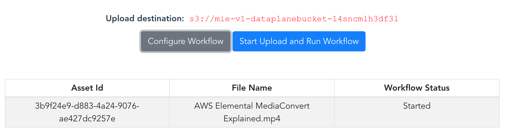
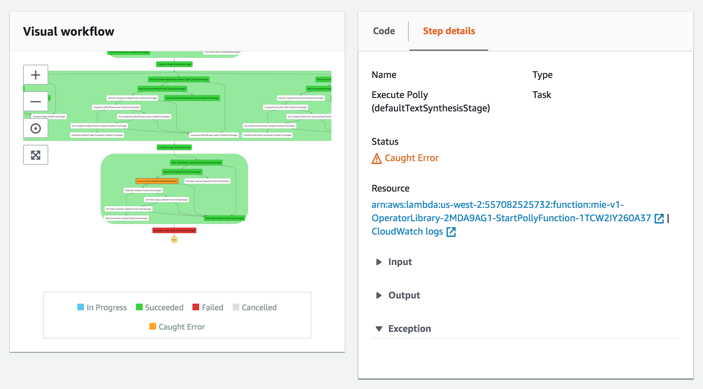
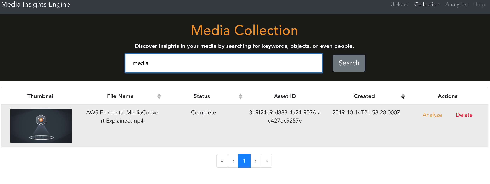
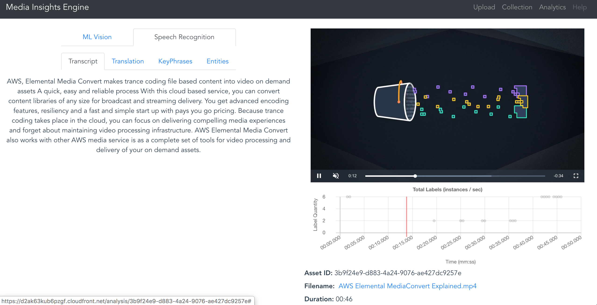
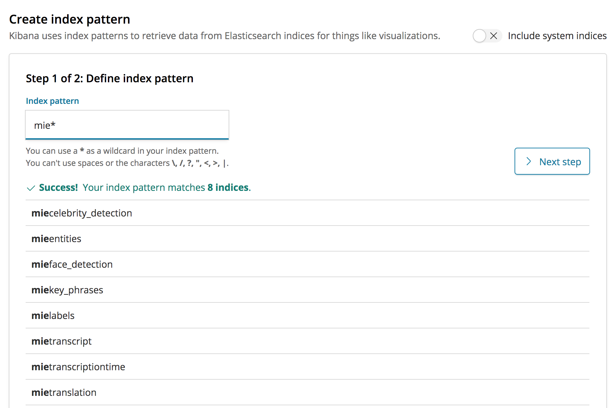

# Media Insights Engine Implementation Guide

This implementation guide discusses architectural considerations and configuration steps for deploying the Media Insights Engine (MIE) solution on the Amazon Web Services (AWS) Cloud. It includes links to an AWS CloudFormation template that launches, configures, and runs the AWS services required to deploy this solution using AWS best practices for security and availability.

The guide is intended for IT infrastructure architects and developers who have practical experience working with video workflows and architecting on the AWS Cloud.


**Contents**

[1. Overview](#1-overview)
- [1.1. Cost](#11-cost)
- [1.2. Architecture Overview](#12-architecture-overview)

[2. AWS CloudFormation Template](#2-aws-cloudformation-template)

[3. Automated Deployment](#3-mated-deployment)
- [3.1. Prerequisites](#31-prerequisites)

[4. Security](#4-security)

[5. Getting Started With the Sample Application](#5-getting-started-with-the-sample-application)
- [5.1. Logging in to the Application](#51-logging-in-to-the-application)
- [5.2. The Upload Page](#52-the-upload-page)
- [5.3. The Collections Page](#53-the-collections-page)
- [5.4. The Analytics Page](#54-the-analytics-page)

[6. Developer Quick Start Guide](#6-developer-quick-start-guide)
- [6.1. Prerequisites](#61-prerequisites)
- [6.2. Building MIE from source code](#62-building-mie-from-source-code)
  - [Build and distribute the code to AWS](#621-build-and-distribute-the-code-to-aws)
  - [Deploy the stack](#622-deploy-the-stack)
- [6.3. Implementing a new Operator in MIE](#63-implementing-a-new-operator-in-mie)
  - [Step 1: Write operator Lambda functions](#step-1-write-operator-lambda-functions)
  - [Step 2: Add your operator to the MIE operator library](#step-2-add-your-operator-to-the-mie-operator-library)        
  - [Step 3: Add your operator to a workflow](#step-3-add-your-operator-to-a-workflow)
  - [Step 4: Add your operator to the Elasticsearch consumer](#step-4-add-your-operator-to-the-elasticsearch-consumer)     
  - [Step 5: Update the build script to deploy your operator to AWS Lambda](#step-5-update-the-build-script-to-deploy-your-operator-to-aws-lambda)        
  - [Step 6: Test your operator](#step-6-test-your-operator)

[7. Glossary](#7-glossary)

[8. API Documentation](#8-api-documentation)


# 1. Overview
This implementation guide discusses architectural considerations and configuration steps for deploying the Media Insights Engine(MIE) solution on the Amazon Web Services (AWS) Cloud. It includes links to an AWS CloudFormation template that launches, configures, and runs the AWS services required to deploy this solution using AWS best practices for security and availability.

The guide is intended for IT infrastructure architects and developers who have practical experience working with video workflows and architecting on the AWS Cloud.

## 1.1. Cost
You are responsible for the cost of the AWS services used while running the MIE solution. The total cost for running this solution depends on the amount of data being ingested and analyzed, running the solutions Amazon Elasticsearch Service cluster, and the size and length of media files analyzed with Amazon Rekognition, Amazon Transcribe, and Amazon Comprehend. For full details, see the pricing webpage for each AWS service you will be using in this solution. For customers who want to process large-scale video archives, we recommend that you contact your AWS account representative for at-scale pricing.

## 1.2. Architecture Overview

Media Insights Engine is a _serverless_ architecture on AWS. The following diagram is an overview of the major components of MIE and how they interact when an MIE workflow is executed.  


# 2. AWS CloudFormation Template

# 3. Automated Deployment

## 3.1. Prerequisites

# 4. Security

# 5. Getting Started With the Sample Application

This document shows how to get started using the provided sample application with the Media Insights Engine(MIE).

This assumes that MIE has been full deployed at this point. 

## 5.1. Logging in to the Application
1. Navigate to the CloudFormation console where you launched MIE.
1. From the **Outputs** tab of your stack, copy the value of `MediaInsightsWebAppUrl` on to your browser. This should open up the sample application.
1. On the login page, enter the email address you provided in the **AdminEmail** for username. Enter the **temporary password** you were emailed in the password. 
1. Enter a new password when prompted to update the temporary one. Save this off somewhere handy in case you have to login back to the sample application. 

## 5.2. The Upload Page
1. Click on the **Upload** link on the top right menu. 
1. Click on **Drop files here to upload**. You may upload any file that's a [supported input type by AWS MediaConvert](https://docs.aws.amazon.com/mediaconvert/latest/ug/reference-codecs-containers-input.html). 
1. After you've selected your file, click on the **Configure Worklow**. 
1. Make sure only the operators you want run are selected. 
1. After selection has been made, click on the **Start Upload and Run Workflow** button. 
1. Once upload has completed and the operators start working on the asset, you should see a workflow status at the bottom of the page as below:

    

## 5.3. The Collections Page

1. Click on the **Collections** link on the top right menu. This page will show all the assets that have been uploaded for analysis so far, and their corresponding status. 
1. When all the operators selected for the workflow has finished running on the asset, the status will show as **Completed**. 
1. If the status on an asset is set to **Error**:
    
    a. Navigate to the **Step Functions** console.
    
    b. Under **State Machines**, click on `MieCompleteWorkflow`. 
    
    c. Under **Executions**, click on the name of the execution that has the Failed 
    status.
    
    d. Inspect the **Visual Workflow** to determine where in the execution the workflow failed.
    
    e. Click on the **CloudWatch** link to get more information on the failure.

    

1. Data collected from all the analysis are stored in Amazon Elasticsearch Service and can be retrieved using Lucene queries in the Collection view search page. Assets matching the query will show up on the page.

    

1. To view the results from running the workflow operators, click on the **Analyze** link under the **Actions** column for a specific asset.

    

## 5.4. The Analytics Page

1. Click on the **Analytics** link on the top right menu. This page will send you to Kibana, which allows you to search and visualize the data that's been collected and stored in Elasticsearch.
1. Click on the **Discover** link from the left-hand side menu. This should take you to a page for creating an index pattern if you haven't created one already. 
1. To create an index pattern, enter `mie*` in the **Index pattern** textbox. This will include all the indices that has already been created.
    
    

1. Click on **Next Step**.
1. Click on **Create Index Pattern**.
1. At this point you're ready to run some queries and visualizations. 

# 6. Developer Quick Start Guide

This document will show you how to build, distribute, and deploy Media Insights Engine (MIE) on AWS and how to implement new operators within the MIE stack.

## 6.1. Prerequisites

* AWS CLI - configured
* Docker - installed and running

## 6.2. Building MIE from source code

### Build and distribute the code to AWS

Use the following shell commands to configure the build environment parameters:

    DIST_OUTPUT_BUCKET=[enter the name of your bucket here]
    VERSION=[enter an arbitrary version name here]
    REGION=[enter the name of the region in which you would like to build MIE]

Create an S3 bucket for the MIE build files named `$DIST_OUTPUT_BUCKET-$REGION` using the input you gave above.

Run the following build command in your terminal from the `deployment` directory:

    ./build-s3-dist.sh $DIST_OUTPUT_BUCKET $VERSION $REGION


After a few minutes the build files should appear in your S3 bucket.

### Deploy the stack

From your S3 bucket, navigate to `media-insights-solution/main/cf/media-insights-stack.template` and use this CloudFormation template to create your stack and deploy MIE.


## 6.3. Implementing a new Operator in MIE

Operators are Lambda functions that:

* derive new media objects from input media and/or 
* generate metadata by analyzing input media. 
  
Operators run as part of an MIE workflow. Workflows are [AWS Step Functions](https://aws.amazon.com/step-functions/) that define the order in which operators run. 

Operators can be _synchronous_ or _asynchronous_.  Synchronous operators start an  analysis (or transformation) job and get its result in a single Lambda function. Async operators use seperate Lambda functions to start jobs and get their results. Typically, async operators run for several minutes.

Operator inputs can include a list of media, metadata and the user-defined workflow and/or operator configurations.

Operator outputs include the execution status, and S3 locators for the newly derived media and metadata objects saved in S3. These outputs get passed to other operators in downstream workflow stages.

Operators should interact with the MIE data persistence layer via the `MediaInsightsEngineLambdaHelper`, which is located under [lib/MediaInsightsEngineLambdaHelper/](./lib/MediaInsightsEngineLambdaHelper/MediaInsightsEngineLambdaHelper/__init__.py).  

### Step 1: Write operator Lambda functions
***(Difficulty: >1 hour)***

*TL;DR - Copy `source/operators/rekognition/generic_data_lookup.py` to a new directory and change it to do what you want.*

Operators live under `source/operators`.  Create a new folder there for your new operator. 

The MIE Helper library should be used inside an operator to interact with the control plane and data plane. This library lives under `lib/MediaInsightsEngineLambdaHelper/`.

#### Using the MIE Helper library

Instantiate the helper like this:

```
from MediaInsightsEngineLambdaHelper import OutputHelper
output_object = OutputHelper("my_operator_name")
```

##### How to get Asset and Workflow IDs

Get the Workflow and Asset ID from the Lambda entrypoint's event object:

```
# Lambda function entrypoint:
def lambda_handler(event, context):
    workflow_id = str(event["WorkflowExecutionId"])
    asset_id = event['AssetId']
```

##### How to get input Media Objects

Media objects are passed using their location in S3.  Use the `boto3` S3 client access them from S3 using the locations specified in the Lambda entrypoint's event object:

```
def lambda_handler(event, context):
    if "Video" in event["Input"]["Media"]:
        s3bucket = event["Input"]["Media"]["Video"]["S3Bucket"]
        s3key = event["Input"]["Media"]["Video"]["S3Key"]
    elif "Image" in event["Input"]["Media"]:
        s3bucket = event["Input"]["Media"]["Image"]["S3Bucket"]
        s3key = event["Input"]["Media"]["Image"]["S3Key"]
```

##### How to get operator configuration input

Operator configurations can be accessed from the Lambda entrypoint's event object:

```
collection_id = event["Configuration"]["CollectionId"]
```

##### How to get metadata output from other operators

Metadata is always passed as input to the next stage in a workflow. Metadata that was output by upstream operators can be accessed from the Lambda entrypoint's event object:

```
job_id = event["MetaData"]["FaceSearchJobId"]
```

##### How to store media metadata to the data plane

Use `store_asset_metadata()` to store results. For paged results, call that function for each page.

```
from MediaInsightsEngineLambdaHelper import DataPlane
dataplane = DataPlane()
metadata_upload = dataplane.store_asset_metadata(asset_id, operator_name, workflow_id, response)
```

##### Store media objects to the data plane S3 bucket

Operators can derive new media objects. For example, the Transcribe operator derives a new text object from an input audio object. Save new media objects with `add_media_object()`, like this:

```
from MediaInsightsEngineLambdaHelper import MediaInsightsOperationHelper
operator_object = MediaInsightsOperationHelper(event)
operator_object.add_media_object(my_media_type, bucket, key)
```

The my_media_type variable should be "Video", "Audio", or "Text".

##### Retrieve media objects from the data plane

```
from MediaInsightsEngineLambdaHelper import MediaInsightsOperationHelper
operator_object = MediaInsightsOperationHelper(event)
bucket = operator_object.input["Media"][my_media_type]["S3Bucket"]
key = operator_object.input["Media"][my_media_type]["S3Key"]
s3_response = s3.get_object(Bucket=bucket, Key=key)
```

The my_media_type variable should be "Video", "Audio", or "Text".

### Step 2: Add your operator to the MIE operator library 
***(Difficulty: 30 minutes)***

*TL;DR - Edit `source/operators/operator-library.yaml` and add new entries for your operator under the following sections:* 

  * `# Lambda Functions`
  * `# IAM Roles`
  * `# Register as operators in the control plane`
  * `# Export operator names as outputs`

This step involves editing the CloudFormation script for deploying the MIE operator library, located at [`source/operators/operator-library.yaml`](source/operators/operator-library.yaml).

#### Create the IAM Role resource

Create a CloudFormation IAM resource that will be used to give your Lambda function the appropriate permissions. MIE operators need `AWSLambdaBasicExecutionRole` plus policies for any other AWS resource and services accessed by the Lambda function. 

#### Create Lambda Function resource

Create a CloudFormation `Lambda::Function` resource for your Operator Lambda function.  If your Operator is _Async_, make sure to also register your monitoring Lambda function.

#### Create the MIE Operator resource using your Lambda function(s)

The MIE Operator custom resource has the following attributes:

```
Type: Custom:CustomResource
Properties:
  ServiceToken: !Ref WorkflowCustomResourceArn
  ResourceType:
    ResourceType
  Name: 
    Name
  Type:
    Type
  Configuration: 
    Configuration
  StartLambdaArn:
    StartLambdaArn
  MonitorLambdaArn:
    MonitorLambdaArn
  StateMachineExecutionRoleArn: !GetAtt StepFunctionRole.Arn
```

  ***ResourceType***

  * Specify the type of resource: `"Operator"`, `"Workflow"`, or `"Stage"`

  ***Name***

  * Specify the name of your Operator

  ***Type***

  * Specify whether your operator is `Sync` or `Async`

  ***Configuration***
  
  * Specify the `MediaType` and `Enabled` fields and add any other configurations needed

  ***StartLambdaArn***

  * Specify the ARN of the Lambda function to start your Operator

  ***MonitorLambdaArn***

  * If your operator is _Async_, specify the ARN of the monitoring Lambda function

#### Export your Operator name as an output

Export your operator as an output like this:
```
  MyOperation:
    Description: "Operation name of MyOperation"
    Value: !GetAtt MyOperation.Name
    Export:
      Name: !Join [":", [!Ref "AWS::StackName", MyOperation]]
```

### Step 3: Add your operator to a workflow 
***(Difficulty: 10 minutes)***

*TL;DR - Edit `source/workflows/MieCompleteWorkflow.yaml` and add your operator under `Resources --> defaultVideoStage --> Operations`*

It's easiest to create a new workflow by copying end editing `MieCompleteWorkflow.yaml`. If you're creating a new workflow, you'll need to know that operators in the same stage will run at the same time (i.e. "in parallel") and stages run sequentially.

### Step 4: Add your operator to the Elasticsearch consumer
***(Difficulty: 30 minutes)***

Edit `source/consumers/elastic/lambda_handler.py`. Add your operator name to the list of `supported_operators`. Define a method to flatten your JSON metadata into Elasticsearch records. Call that method from the `lambda_handler()` entrypoint. 

### Step 5: Update the build script to deploy your operator to AWS Lambda
***(Difficulty: 5 minutes)***

Update the `# Make lambda package` section in [`build-s3-dist.sh`](deployment/build-s3-dist.sh) to zip your operator's Lambda function(s) into the `deployment/dist` directory, like this:

```
zip -r9 my_operator.zip my_operator.py
```

### Step 6: Test your operator

To test your operator you'll want to run a workflow from the command line. 

#### Obtain a Cognito Token

First define the following environment variables. `MIE_USERNAME` and `MIE_PASSWORD` should have been emailed to the email address you specified when you deployed the stack. `MIE_DEVELOPMENT_HOME` should be the path to your `aws-media-insights-engine/` development environment, such as `/Users/myuser/development/aws-media-insights-engine/`.

```
export MIE_STACK_NAME=
export REGION=
export MIE_USERNAME=
export MIE_PASSWORD=
export MIE_DEVELOPMENT_HOME=
```

Now run the following two commands:

```
export MIE_POOL_ID=$(aws cloudformation list-stack-resources --stack-name $MIE_STACK_NAME --region $REGION  --query 'StackResourceSummaries[?LogicalResourceId==`MieUserPool`].PhysicalResourceId' --output text)

export MIE_CLIENT_ID=$(aws cloudformation list-stack-resources --stack-name $MIE_STACK_NAME --region $REGION --query 'StackResourceSummaries[?LogicalResourceId==`MieAdminClient`].PhysicalResourceId' --output text)

export DATAPLANE_BUCKET=$(aws cloudformation describe-stacks --stack-name $MIE_STACK_NAME --region $REGION --query 'Stacks[0].Outputs[?OutputKey==`DataplaneBucket`].OutputValue' --output text)

export WORKFLOW_API_ENDPOINT=$(aws cloudformation describe-stacks --stack-name $MIE_STACK_NAME --region $REGION --query 'Stacks[0].Outputs[?OutputKey==`WorkflowApiEndpoint`].OutputValue' --output text)  
```

Get the token like this:
```
export MIE_ACCESS_TOKEN=$(VENV=$(mktemp -d); python3 -m venv $VENV; source $VENV/bin/activate; pip --disable-pip-version-check install -q boto3; python3 $MIE_DEVELOPMENT_HOME/tests/getAccessToken.py | tail -n 1; deactivate; rm -rf $VENV)
```

If you set MIE_PASSWORD to your temporary password, you will be prompted to update this password. Update your exported MIE_PASSWORD with the updated one. 

Note that tokens are only good for an hour and you will have to regenerate a new MIE_ACCESS_TOKEN when it expires.

Now you can `curl` MIE APIs with the `-H "Authorization: $MIE_ACCESS_TOKEN"` option.  

#### Test your operator

Here's how to start the MieCompleteWorkflow with only `MyOperator` enabled:

```
curl -k -X POST -H "Authorization: $MIE_ACCESS_TOKEN" -H "Content-Type: application/json" --data '{"Name":"MieCompleteWorkflow","Configuration":{"defaultVideoStage":{"faceDetection":{"Enabled":false},"celebrityRecognition":{"Enabled":false},"MyOperator":{"Enabled":true},"labelDetection":{"Enabled":false},"personTracking":{"Enabled":false},"Mediaconvert":{"Enabled":false},"contentModeration":{"Enabled":false},"faceSearch":{"Enabled":false}}},"Input":{"Media":{"Video":{"S3Bucket":"'$DATAPLANE_BUCKET'","S3Key":"my_input.mp4"}}}}'  $WORKFLOW_API_ENDPOINT/workflow/execution 
```
#### Monitor your test

Monitor your test workflow with the following logs:

* Your operator lambda. To find this log, search the Lambda functions for your operator name.
* The dataplane API lambda. To find this log, search Lambda functions for "MediaInsightsDataplaneApiStack".
* The Elasticsearch consumer lambda. To find this log, search Lambda functions for "ElasticsearchConsumer".

# 7. API Documentation

## Summary:
* Dataplane API
    * GET /
    * POST /create
    * POST /download
    * GET /mediapath/{asset_id}/{workflow_id}
    * GET /metadata
    * DELETE /metadata/{asset_id}
    * DELETE /metadata/{asset_id}/{operator_name}
    * POST /upload
* Workflow API
    * GET /
    * POST /system/configuration
    * POST /workflow
    * GET /workflow/configuration/{Name}
    * POST /workflow/execution
    * GET /workflow/execution/asset/{AssetId}
    * GET /workflow/execution/status/{Status}
    * DELETE /workflow/execution/{Id}
    * POST /workflow/operation
    * DELETE /workflow/operation/{Name}
    * POST /workflow/stage
    * DELETE /workflow/stage/{Name}
    * DELETE /workflow/{Name}

## Dataplane API

* Create an asset in the dataplane from a json input composed of the input key and bucket of the object:

    `POST /create`

    ```
    Body:
    
    {
        "Input": {
            "S3Bucket": "{somenbucket}",
            "S3Key": "{somekey}"
        }
    }
    ```
    Returns: A dict mapping of the asset id and the new location of the media object

* Retrieve metadata for an asset:

    `GET /metadata/{asset_id}`

    Returns: All asset metadata

* Add operation metadata for an asset:

    `POST /metadata/{asset_id}`
    
    ```
    Body:
    
    {
        "OperatorName": "{some_operator}",
        "Results": "{json_formatted_results}"
    }
    ```

* Retrieve the metadata that a specific operator created from an asset: 

    `GET /metadata/{asset_id}/{operator_name}`

## Workflow API

* Add a new system configuration parameter or update an existing MIE system configuration parameter:

    `POST /system/configuration`

    ```
    Body:
    
    {
        "Name": "ParameterName",
        "Value": "ParameterValue"
    }
    ```
  
    Supported parameters:
    * ***MaxConcurrentWorkflows*** - Sets the maximum number of workflows that are allowed to run concurrently. Any new workflows that are added after MaxConcurrentWorkflows is reached are placed on a queue until capacity is freed by completing workflows. Use this to help avoid throttling in service API calls from workflow operators. This setting is checked each time the WorkflowSchedulerLambda is run and may take up to 60 seconds to take effect.

    Returns: None
    
    Raises: 
    * 200: The system configuration was set successfully successfully. 
    * 400: Bad Request
    * 500: Internal server error - an input value is invalid

* Get the current MIE system configuration
    
    `GET /system/configuration`

    Returns:
    * A list of dict containing the current MIE system configuration key-value pairs.

    Raises:
    * 200: The system configuration was returned successfully. 
    * 500: Internal server error

* Create a workflow from a list of existing stages. A workflow is a pipeline of stages that are executed sequentially to transform and extract metadata for a set of MediaType objects. Each stage must contain either a “Next” key indicating the next stage to execute or and “End” key indicating it is the last stage.

    `POST /workflow`
    ```
    Body:
    
    {
        "Name": string,
        "StartAt": string - name of starting stage,
        "Stages": {
            "stage-name": {
                "Next": "string - name of next stage"
            },
            ...,
            "stage-name": {
                "End": true
            }
        }
    }
    ```
    Returns:
    * A dict mapping keys to the corresponding workflow created including the AWS resources used to execute each stage.

    Raises:
    * 200: The workflow was created successfully. 
    * 400: Bad Request - one of the input stages was not found or was invalid 
    * 500: Internal server error

* List all workflow defintions

    `GET /workflow`
    
    Returns:
    * A list of workflow definitions.

    Raises:
    * 200: All workflows returned sucessfully. 
    * 500: Internal server error

* Get a workflow configruation object by name

    `GET /workflow/configuration/{Name}`

    Returns:
    * A dictionary contianing the workflow configuration.

    Raises:
    * 200: All workflows returned sucessfully. 
    * 404: Not found 
    * 500: Internal server error

* Execute a workflow. The Body contains the name of the workflow to execute, at least one input media type within the media object. A dictionary of stage configuration objects can be passed in to override the default configuration of the operations within the stages.

    `POST /workflow/execution`
    ```
    Body:
    
    {
    "Name":"Default",
    "Input": media-object
    "Configuration": {
        {
        "stage-name": {
            "Operations": {
                "SplitAudio": {
                   "Enabled": True,
                   "MediaTypes": {
                       "Video": True/False,
                       "Audio": True/False,
                       "Frame": True/False
                   }
               },
           },
       }
       ...
       }
    }
    ```
    Returns:
    * A dict mapping keys to the corresponding workflow execution created including the WorkflowExecutionId, the AWS queue and state machine resources assiciated with the workflow execution and the current execution status of the workflow.

    Raises:
    * 200: The workflow execution was created successfully. 
    * 400: Bad Request - the input workflow was not found or was invalid 
    * 500: Internal server error

* List all workflow executions:

    `GET /workflow/execution`

    Returns:
    * A list of workflow executions.

    Raises:
    * 200: All workflow executions returned sucessfully. 
    * 500: Internal server error

* Get workflow executions by AssetId:

    `GET /workflow/execution/asset/{AssetId}`

    Returns:
    * A list of dictionaries containing the workflow executions matching the AssetId.

    Raises:
    * 200: Workflow executions returned sucessfully. 
    * 404: Not found 
    * 500: Internal server error

* Get all workflow executions with the specified status:

    `GET /workflow/execution/status/{Status}`

    Returns:
    * A list of dictionaries containing the workflow executions with the requested status

    Raises:
    * 200: All workflows returned sucessfully. 
    * 404: Not found 
    * 500: Internal server error

* Delete a workflow executions:

    `DELETE /workflow/execution/{Id}`
    
    Raises:
    * 200: Workflow execution deleted sucessfully. 
    * 404: Not found 
    * 500: Internal server error

* Get a workflow execution by id

    `GET /workflow/execution/{Id}`

    Returns:
    * A dictionary containing the workflow execution.

    Raises:
    * 200: Workflow executions returned sucessfully. 
    * 404: Not found 
    * 500: Internal server error

* Create a new operation

    `POST /workflow/operation`
    
    Generates an operation state machine using the operation lambda(s) provided
    
    Creates a singleton operator stage that can be used to run the operator as a single-operator stage in a workflow.
    
    Operators can be synchronous (Sync) or asynchronous (Async). Synchronous operators complete before returning control to the invoker, while asynchronous operators return control to the invoker when the operation is successfully initiated, but not complete. Asynchronous operators require an additional monitoring task to check the status of the operation.
    
    For more information on how to implemenent lambdas to be used in MIE operators, see [6.3. Implementing a new Operator in MIE](#63-implementing-a-new-operator-in-mie)
    
    ```
    Body:
    
    {
        "Name":"operation-name",
        "Type": ["Async"|"Sync"],
        "Configuration" : {
                "MediaType": "Video",
                "Enabled:": True,
                "configuration1": "value1",
                "configuration2": "value2",
                ...
            }
        "StartLambdaArn":arn,
        "MonitorLambdaArn":arn,
        "SfnExecutionRole": arn
        }
    ```
    Returns:
    * A dict mapping keys to the corresponding operation.
    ```
    {
        "Name": string,
        "Type": ["Async"|"Sync"],
        "Configuration" : {
            "MediaType": "Video|Frame|Audio|Text|...",
            "Enabled:": boolean,
            "configuration1": "value1",
            "configuration2": "value2",
            ...
        }
        "StartLambdaArn":arn,
        "MonitorLambdaArn":arn,
        "StateMachineExecutionRoleArn": arn,
        "StateMachineAsl": ASL-string
        "StageName": string
    }
    ```
    Raises:
    * 200: The operation and stage was created successfully. 
    * 400: Bad Request
        * one of the input lambdas was not found
        * one or more of the required input keys is missing
        * an input value is invalid
    * 409: Conflict 
    * 500: Internal server error

* List all defined operators

    `GET /workflow/operation`  
    
    Returns:
    * A list of operation definitions.
    
    Raises:
    * 200: All operations returned sucessfully. 
    * 500: Internal server error

* Delete a an operation

    `DELETE /workflow/operation/{Name}`
    
    Raises:
    * 200: Operation deleted sucessfully. 
    * 500: Internal server error

* Get an operation definition by name
    
    `GET /workflow/operation/{Name}`
    
    Returns:
    * A dictionary containing the operation definition.
    
    Raises:
    * 200: All operations returned sucessfully. 
    * 404: Not found 
    * 500: Internal server error

* Create a stage state machine from a list of existing operations. A stage is a set of operations that are grouped so they can be executed in parallel. When the stage is executed as part of a workflow, operations within a stage are executed as branches in a parallel Step Functions state. The generated state machines status is tracked by the workflow engine control plane during execution.
    
    An optional Configuration for each operator in the stage can be input to override the default configuration for the stage.
    
    `POST /workflow/stage`
    ```
    Body:
    
    {
    "Name":"stage-name",
    "Operations": ["operation-name1", "operation-name2", ...]
    }
    Returns:
    A dict mapping keys to the corresponding stage created including the ARN of the state machine created.
    
    {
    “Name”: string, “Operations”: [
    
    “operation-name1”, “operation-name2”, …
    ], “Configuration”: {
    
    “operation-name1”: operation-configuration-object1, “operation-name2”: operation-configuration-object1, …
    } “StateMachineArn”: ARN-string
    
    “Name”: “TestStage”, “Operations”: [
    
    “TestOperator”
    ], “Configuration”: {
    
    “TestOperator”: {
    “MediaType”: “Video”, “Enabled”: true
    }
    }, “StateMachineArn”: “arn:aws:states:us-west-2:526662735483:stateMachine:TestStage”
    }
    ```
    
    Raises:
    * 200: The stage was created successfully. 
    * 400: Bad Request - one of the input state machines was not found or was invalid 
    * 409: Conflict 
    * 500: Internal server error

* List all stage defintions

    `GET /workflow/stage`
    
    Returns:
    * A list of operation definitions.
    
    Raises:
    * 200: All operations returned sucessfully. 
    * 500: Internal server error

* Delete a stage
    
    `DELETE /workflow/stage/{Name}`
    
    Returns:
    
    Raises:
    * 200: Stage deleted sucessfully. 
    * 404: Not found 
    * 500: Internal server error

* Get a stage definition by name

    `GET /workflow/stage/{Name}`
    
    Returns:
    A dictionary contianing the stage definition.
    
    Raises:
    * 200: All stages returned sucessfully. 
    * 404: Not found 
    * 500: Internal server error

* Delete a workflow
    
    `DELETE /workflow/{Name}`
    
    Returns:
    
    Raises:
    * 200: Workflow deleted sucessfully. 
    * 404: Not found 
    * 500: Internal server error

* Get a workflow definition by name

    `GET /workflow/{Name}`
    
    Returns:
    * A dictionary contianing the workflow definition.
    
    Raises:
    * 200: All workflows returned sucessfully. 
    * 404: Not found 
    * 500: Internal server error

# 8. Glossary

## Workflow API
Triggers the execution of a workflow. Also triggers create, update and delete workflows and operators.  Monitors the status of workflows.

## Control plane
Executes the AWS Step Functions state machine for the workflow against the provided input.  Workflow state machines are generated from MIE operators.  As operators within the state machine are executed, the interact with the MIE data plane to store and retrieve derived asset and metadata generated from the workflow.  

## Operators
Generated state machines that perform media analysis or transformation operation.

## Workflows
Generated state machines that execute a number of operators in sequence.

## Data plane
Stores media assets and their associated metadata that are generated by workflows. 

## Data plane API

Trigger create, update, delete and retrieval of media assets and their associated metadata.

## Data plane pipeline

Stores metadata for an asset that can be retrieved as a single block or pages of data using the objects AssetId and Metadata type.  Writing data to the pipeline triggers a copy of the data to be stored in a **Kinesis Stream**.

### **Data plane pipeline consumer**

A lambda function that consumes data from the data plane pipeline and stores it (or acts on it) in another downstream data store.  Data can be stored in different kind of data stores to fit the data management and query needs of the application.  There can be 0 or more pipeline consumers in a MIE application.

# API Documentation:

## Summary:
* Dataplane API
    * GET /
    * POST /create
    * POST /download
    * GET /mediapath/{asset_id}/{workflow_id}
    * GET /metadata
    * DELETE /metadata/{asset_id}
    * DELETE /metadata/{asset_id}/{operator_name}
    * POST /upload
* Workflow API
    * GET /
    * POST /system/configuration
    * POST /workflow
    * GET /workflow/configuration/{Name}
    * POST /workflow/execution
    * GET /workflow/execution/asset/{AssetId}
    * GET /workflow/execution/status/{Status}
    * DELETE /workflow/execution/{Id}
    * POST /workflow/operation
    * DELETE /workflow/operation/{Name}
    * POST /workflow/stage
    * DELETE /workflow/stage/{Name}
    * DELETE /workflow/{Name}

## Dataplane API

* Create an asset in the dataplane from a json input composed of the input key and bucket of the object:

    `POST /create`

    ```
    Body:
    
    {
        "Input": {
            "S3Bucket": "{somenbucket}",
            "S3Key": "{somekey}"
        }
    }
    ```
    Returns: A dict mapping of the asset id and the new location of the media object

* Retrieve metadata for an asset:

    `GET /metadata/{asset_id}`

    Returns: All asset metadata

* Add operation metadata for an asset:

    `POST /metadata/{asset_id}`
    
    ```
    Body:
    
    {
        "OperatorName": "{some_operator}",
        "Results": "{json_formatted_results}"
    }
    ```

* Retrieve the metadata that a specific operator created from an asset: 

    `GET /metadata/{asset_id}/{operator_name}`

## Workflow API

* Add a new system configuration parameter or update an existing MIE system configuration parameter:

    `POST /system/configuration`

    ```
    Body:
    
    {
        "Name": "ParameterName",
        "Value": "ParameterValue"
    }
    ```
  
    Supported parameters:
    * ***MaxConcurrentWorkflows*** - Sets the maximum number of workflows that are allowed to run concurrently. Any new workflows that are added after MaxConcurrentWorkflows is reached are placed on a queue until capacity is freed by completing workflows. Use this to help avoid throttling in service API calls from workflow operators. This setting is checked each time the WorkflowSchedulerLambda is run and may take up to 60 seconds to take effect.

    Returns: None
    
    Raises: 
    * 200: The system configuration was set successfully successfully. 
    * 400: Bad Request
    * 500: Internal server error - an input value is invalid

* Get the current MIE system configuration
    
    `GET /system/configuration`

    Returns:
    * A list of dict containing the current MIE system configuration key-value pairs.

    Raises:
    * 200: The system configuration was returned successfully. 
    * 500: Internal server error

* Create a workflow from a list of existing stages. A workflow is a pipeline of stages that are executed sequentially to transform and extract metadata for a set of MediaType objects. Each stage must contain either a “Next” key indicating the next stage to execute or and “End” key indicating it is the last stage.

    `POST /workflow`
    ```
    Body:
    
    {
        "Name": string,
        "StartAt": string - name of starting stage,
        "Stages": {
            "stage-name": {
                "Next": "string - name of next stage"
            },
            ...,
            "stage-name": {
                "End": true
            }
        }
    }
    ```
    Returns:
    * A dict mapping keys to the corresponding workflow created including the AWS resources used to execute each stage.

    Raises:
    * 200: The workflow was created successfully. 
    * 400: Bad Request - one of the input stages was not found or was invalid 
    * 500: Internal server error

* List all workflow defintions

    `GET /workflow`
    
    Returns:
    * A list of workflow definitions.

    Raises:
    * 200: All workflows returned sucessfully. 
    * 500: Internal server error

* Get a workflow configruation object by name

    `GET /workflow/configuration/{Name}`

    Returns:
    * A dictionary contianing the workflow configuration.

    Raises:
    * 200: All workflows returned sucessfully. 
    * 404: Not found 
    * 500: Internal server error

* Execute a workflow. The Body contains the name of the workflow to execute, at least one input media type within the media object. A dictionary of stage configuration objects can be passed in to override the default configuration of the operations within the stages.

    `POST /workflow/execution`
    ```
    Body:
    
    {
    "Name":"Default",
    "Input": media-object
    "Configuration": {
        {
        "stage-name": {
            "Operations": {
                "SplitAudio": {
                   "Enabled": True,
                   "MediaTypes": {
                       "Video": True/False,
                       "Audio": True/False,
                       "Frame": True/False
                   }
               },
           },
       }
       ...
       }
    }
    ```
    Returns:
    * A dict mapping keys to the corresponding workflow execution created including the WorkflowExecutionId, the AWS queue and state machine resources assiciated with the workflow execution and the current execution status of the workflow.

    Raises:
    * 200: The workflow execution was created successfully. 
    * 400: Bad Request - the input workflow was not found or was invalid 
    * 500: Internal server error

* List all workflow executions:

    `GET /workflow/execution`

    Returns:
    * A list of workflow executions.

    Raises:
    * 200: All workflow executions returned sucessfully. 
    * 500: Internal server error

* Get workflow executions by AssetId:

    `GET /workflow/execution/asset/{AssetId}`

    Returns:
    * A list of dictionaries containing the workflow executions matching the AssetId.

    Raises:
    * 200: Workflow executions returned sucessfully. 
    * 404: Not found 
    * 500: Internal server error

* Get all workflow executions with the specified status:

    `GET /workflow/execution/status/{Status}`

    Returns:
    * A list of dictionaries containing the workflow executions with the requested status

    Raises:
    * 200: All workflows returned sucessfully. 
    * 404: Not found 
    * 500: Internal server error

* Delete a workflow executions:

    `DELETE /workflow/execution/{Id}`
    
    Raises:
    * 200: Workflow execution deleted sucessfully. 
    * 404: Not found 
    * 500: Internal server error

* Get a workflow execution by id

    `GET /workflow/execution/{Id}`

    Returns:
    * A dictionary containing the workflow execution.

    Raises:
    * 200: Workflow executions returned sucessfully. 
    * 404: Not found 
    * 500: Internal server error

* Create a new operation

    `POST /workflow/operation`
    
    Generates an operation state machine using the operation lambda(s) provided
    
    Creates a singleton operator stage that can be used to run the operator as a single-operator stage in a workflow.
    
    Operators can be synchronous (Sync) or asynchronous (Async). Synchronous operators complete before returning control to the invoker, while asynchronous operators return control to the invoker when the operation is successfully initiated, but not complete. Asynchronous operators require an additional monitoring task to check the status of the operation.
    
    For more information on how to implemenent lambdas to be used in MIE operators, see [6.3. Implementing a new Operator in MIE](#63-implementing-a-new-operator-in-mie)
    
    ```
    Body:
    
    {
        "Name":"operation-name",
        "Type": ["Async"|"Sync"],
        "Configuration" : {
                "MediaType": "Video",
                "Enabled:": True,
                "configuration1": "value1",
                "configuration2": "value2",
                ...
            }
        "StartLambdaArn":arn,
        "MonitorLambdaArn":arn,
        "SfnExecutionRole": arn
        }
    ```
    Returns:
    * A dict mapping keys to the corresponding operation.
    ```
    {
        "Name": string,
        "Type": ["Async"|"Sync"],
        "Configuration" : {
            "MediaType": "Video|Frame|Audio|Text|...",
            "Enabled:": boolean,
            "configuration1": "value1",
            "configuration2": "value2",
            ...
        }
        "StartLambdaArn":arn,
        "MonitorLambdaArn":arn,
        "StateMachineExecutionRoleArn": arn,
        "StateMachineAsl": ASL-string
        "StageName": string
    }
    ```
    Raises:
    * 200: The operation and stage was created successfully. 
    * 400: Bad Request
        * one of the input lambdas was not found
        * one or more of the required input keys is missing
        * an input value is invalid
    * 409: Conflict 
    * 500: Internal server error

* List all defined operators

    `GET /workflow/operation`  
    
    Returns:
    * A list of operation definitions.
    
    Raises:
    * 200: All operations returned sucessfully. 
    * 500: Internal server error

* Delete a an operation

    `DELETE /workflow/operation/{Name}`
    
    Raises:
    * 200: Operation deleted sucessfully. 
    * 500: Internal server error

* Get an operation definition by name
    
    `GET /workflow/operation/{Name}`
    
    Returns:
    * A dictionary containing the operation definition.
    
    Raises:
    * 200: All operations returned sucessfully. 
    * 404: Not found 
    * 500: Internal server error

* Create a stage state machine from a list of existing operations. A stage is a set of operations that are grouped so they can be executed in parallel. When the stage is executed as part of a workflow, operations within a stage are executed as branches in a parallel Step Functions state. The generated state machines status is tracked by the workflow engine control plane during execution.
    
    An optional Configuration for each operator in the stage can be input to override the default configuration for the stage.
    
    `POST /workflow/stage`
    ```
    Body:
    
    {
    "Name":"stage-name",
    "Operations": ["operation-name1", "operation-name2", ...]
    }
    Returns:
    A dict mapping keys to the corresponding stage created including the ARN of the state machine created.
    
    {
    “Name”: string, “Operations”: [
    
    “operation-name1”, “operation-name2”, …
    ], “Configuration”: {
    
    “operation-name1”: operation-configuration-object1, “operation-name2”: operation-configuration-object1, …
    } “StateMachineArn”: ARN-string
    
    “Name”: “TestStage”, “Operations”: [
    
    “TestOperator”
    ], “Configuration”: {
    
    “TestOperator”: {
    “MediaType”: “Video”, “Enabled”: true
    }
    }, “StateMachineArn”: “arn:aws:states:us-west-2:526662735483:stateMachine:TestStage”
    }
    ```
    
    Raises:
    * 200: The stage was created successfully. 
    * 400: Bad Request - one of the input state machines was not found or was invalid 
    * 409: Conflict 
    * 500: Internal server error

* List all stage defintions

    `GET /workflow/stage`
    
    Returns:
    * A list of operation definitions.
    
    Raises:
    * 200: All operations returned sucessfully. 
    * 500: Internal server error

* Delete a stage
    
    `DELETE /workflow/stage/{Name}`
    
    Returns:
    
    Raises:
    * 200: Stage deleted sucessfully. 
    * 404: Not found 
    * 500: Internal server error

* Get a stage definition by name

    `GET /workflow/stage/{Name}`
    
    Returns:
    A dictionary contianing the stage definition.
    
    Raises:
    * 200: All stages returned sucessfully. 
    * 404: Not found 
    * 500: Internal server error

* Delete a workflow
    
    `DELETE /workflow/{Name}`
    
    Returns:
    
    Raises:
    * 200: Workflow deleted sucessfully. 
    * 404: Not found 
    * 500: Internal server error

* Get a workflow definition by name

    `GET /workflow/{Name}`
    
    Returns:
    * A dictionary contianing the workflow definition.
    
    Raises:
    * 200: All workflows returned sucessfully. 
    * 404: Not found 
    * 500: Internal server error
