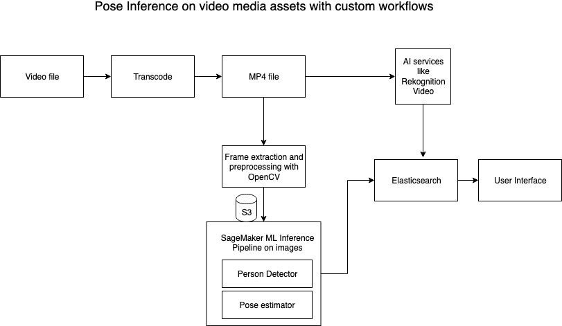
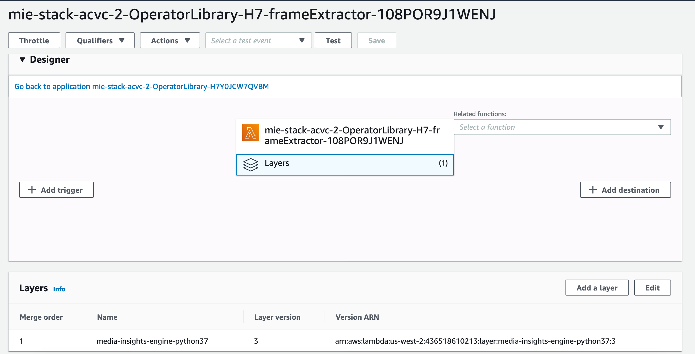

The objective of the workshop is to build custom ML model inference on video assets in Media Insights Engine (MIE) . The use case here is "pose detection" in a video. We will use a SageMaker inference pipeline of 2 pre-trained deep learning models hosted on a single endpoint. 

# Components : 

1) Pre-trained models:

   Top down strategy for pose detection. First, detect persons in bounding boxes from an object detection model. Second, estimate pose from key joints of the body. Gluoncv toolkit on MXNet framework is used here with yolov3 person detector + alpha pose estimator.
   https://gluon-cv.mxnet.io/build/examples_pose/demo_alpha_pose.html#sphx-glr-build-examples-pose-demo-alpha-pose-py
   
2) SageMaker inference pipeline:

   Model inference is hosted on a single SageMaker endpoint with inference pipeline of person detector + pose estimator. A custom MIE operator is created for inference with SageMaker.
   https://docs.aws.amazon.com/sagemaker/latest/dg/inference-pipelines.html
   
3) Serverless video frame processing:

   Video is pre-processed at a desired sampling rate (FPS) to generate image frames and their associated timestamps in S3. This  is achieved with opencv library which is added as a lambda layer. A custom MIE operator is created for video frame processing.
   
4) Custom MIE operators and workflow:

MIE generates workflows using Step Function service state machines. Operators are created by implementing resources (e.g. lambda, sagemaker) that can plug in to MIE state machines as tasks and registering them as operators using the MIE API. 
Operator inputs include a list of Media, Metadata and the operator Configuration plus ids for the workflow execution the operator is part of and the asset the operator is processing.

5) UI integration:

  The web app is modified to include an additional tab for 'Pose'. Pose inference is associated with the timestamp and visualized as an overlay during playback. 
  
  
  
 # Prerequisites : 
 
  1. AWS account with available limits for 1 ml.g4dn.2xlarge instance for sagemaker hosting. (Alternatively, you can specify another instance type during cloud formation deployment) 
  
  2. AWS CLI configured. Refer  https://docs.aws.amazon.com/cli/latest/userguide/cli-configure-quickstart.html#cli-configure-quickstart-config
  
  3. Docker engine - installed and running

 # Execution steps : 
 
 1. Clone this github repository 

    git clone -b acvc2020 --single-branch https://github.com/awslabs/aws-media-insights-engine.git (HTTPS) 
 
 2. Create a S3 bucket in your AWS account. 
    
    Create the following environment variables in command line

     DIST_OUTPUT_BUCKET=[enter the name of your bucket here]

     VERSION=[enter an arbitrary version name here]

     REGION=[enter the name of the region in which you would like to build MIE]
     
     ** Make sure that Cognito is available in the region you select. https://docs.aws.amazon.com/general/latest/gr/aws-general.pdf#aws-service-information
     
 3.  [10 minutes] 
      Prerequisites : 

      a) install wget.
      b) install and start docker engine.

      Run the following build command in your terminal from the deployment directory:

       cd aws-media-insights-engine/deployment

      ./build-s3-dist.sh $DIST_OUTPUT_BUCKET $VERSION $REGION 

 4.  Identify your 12 digit AWS AccountID https://docs.aws.amazon.com/IAM/latest/UserGuide/console_account-alias.html#FindingYourAWSId
      
     AccountId=[enter your 12 digit AWS account ID]. (12 digit only)

     Create a S3 bucket named 'pose-bucket-$REGION-$AccountId' to upload pose inference scripts. 
     NOTE : The bucket has to follow the above format.
     
  5. Copy contents of models/ into the S3 bucket 'pose-bucket-$REGION-$AccountId'

     models/* -> 'pose-bucket-$REGION-$AccountId'/*
     
  6. Make sure account limits are raised to support 1 'Amazon SageMaker Hosting' instance type. For sub-second inference, the default instance type used here is with GPU  'ml.g4dn.2xlarge'. It is however not required to use GPU instance. You can provide another instance type as a parameter during cloud formation deployment. 
  
    https://docs.aws.amazon.com/general/latest/gr/sagemaker.html
  
  7. [20 minutes] Step 3 created a cloud formation template in S3. Use the Amazon S3 URL (output from Step 3) and deploy the cloud formation template.

     https://docs.aws.amazon.com/AWSCloudFormation/latest/UserGuide/cfn-console-create-stack.html 
     
     - Provide a unique stack name.
     - Provide AdminEmail (email address where you will receive credentials for the web app).
     - Edit 'SagemakerEndpointInstanceType' to instance type of your choice for sagemaker hosting. 
     - Click Next and Create Stack.
     
      
  
  8. Create a lambda layer for opencv (via console or command line). You can deploy the zip package pre-built for Amazon Linux available in this repository at opencv/cv2.zip. 
  
     [AWS Lambda Console]  
     
     [Command line] https://awscli.amazonaws.com/v2/documentation/api/latest/reference/lambda/publish-layer-version.html
  
  9. Attach the lambda layer to the frame processing operator. Search for '*frameExtractor*' lambda function and add additional layer. 
  
     [AWS Lambda Console]  
  
  10. There are 3 example videos uploaded to this repository. You can download and upload them to the Media Insights Engine web app. 
  
      Videos are : 
      https://www.pexels.com/video/a-boxer-training-in-a-boxing-gym-4438086/

      https://www.pexels.com/video/woman-doing-a-stretching-exercise-4536532/

      https://www.pexels.com/video/man-with-prosthetic-leg-practicing-in-a-gym-4108624/
      
 Upload any video (landscape mode only) .mp4 file (upto 10 minutes in length) through the MIE console. Choose 'Configure workflow' to turn off other AI services if not required. 
Observe the pose inference results (**1 person pose only**) in a new tab named 'Pose' . 

  11. Lastly, remember to be frugal and delete your cloud formation stack OR delete the sagemaker endpoint instance (you can recreate it from the stored model and endpoint configuration once again )

  
  
     
     

     
  

