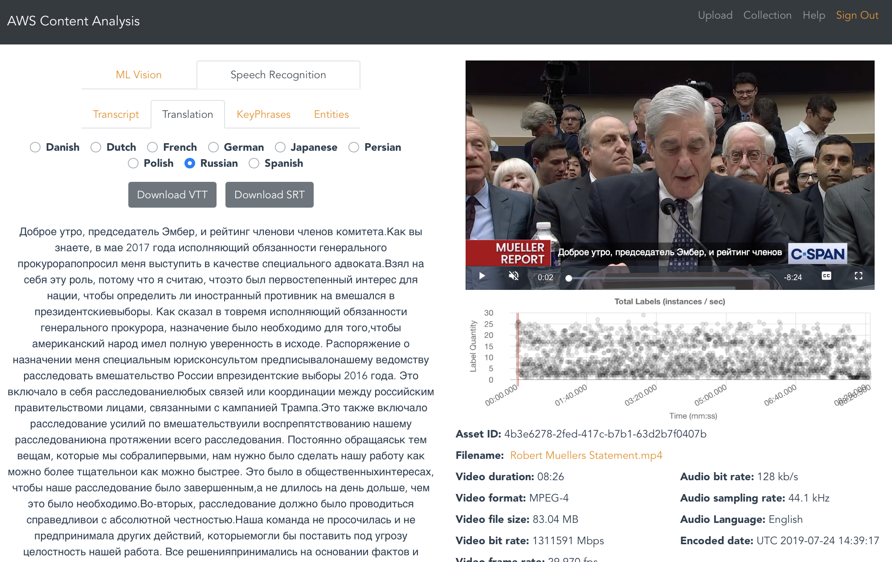
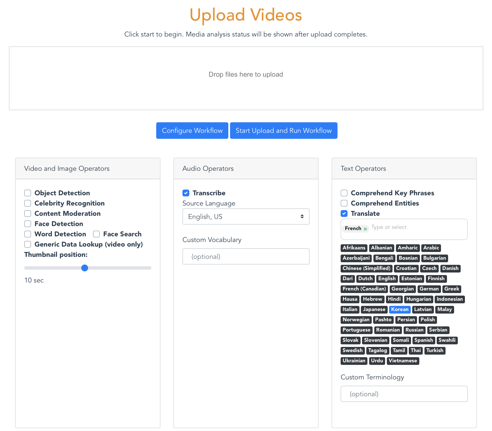
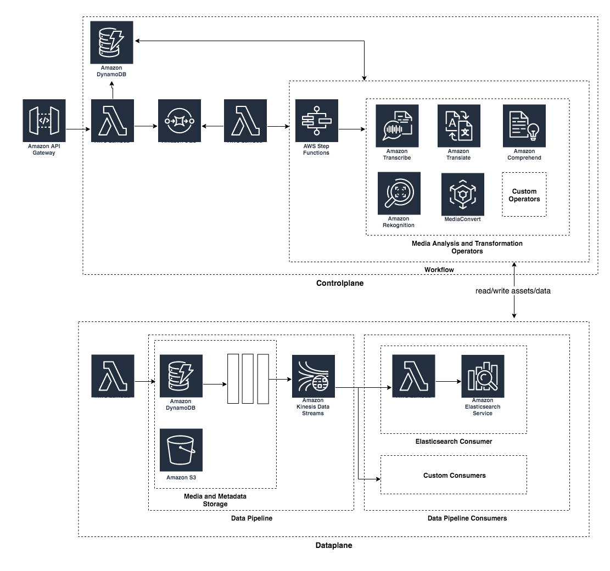

# Media Insights Engine

This fork of the Media Insights Engine (MIE) project was built for transcribing and translating speech in videos.

MIE is a framework to accelerate the development of serverless applications that process video, images, audio, and text with artificial intelligence services and multimedia services on AWS. MIE is most often used to: 

1. Create media analysis workflows using [Amazon Rekognition](https://aws.amazon.com/rekognition/), [Amazon Transcribe](https://aws.amazon.com/transcribe/), [Amazon Translate](https://aws.amazon.com/translate/), [Amazon Cognito](https://aws.amazon.com/cognito/), [Amazon Polly](https://aws.amazon.com/polly/), and [AWS Elemental MediaConvert](https://aws.amazon.com/mediaconvert/).
2. Build analytical applications on top of data extracted by workflows and saved in the [Amazon Elasticsearch Service](https://aws.amazon.com/elasticsearch-service/)

MIE includes a demo GUI for video content analysis and search. The [Implementation Guide](https://github.com/awslabs/aws-media-insights-engine/blob/master/IMPLEMENTATION_GUIDE.md) explains how to build other applications with MIE. 

# Installation
You can deploy MIE and the demo GUI in your AWS account with the following one-click deploy buttons:

Region| Launch
------|-----
US West (Oregon) | 
EU West (Ireland) | 

The default settings for the template will deploy MIE and the demo GUI. You must set the parameters for `Stack name` and `AdminEmail`.

For more information about stack deployment, see the section on [installation parameters](#installation-parameters).

# Screenshots

Translation analysis:

Workflow configuration:

# Cost

Most AWS accounts include a free tier for the services used in MIE. However, if your usage exceeds the free tier allotments then you will be responsible for the cost of the AWS services used while running MIE. 

The cost depends on the number of and length of uploaded videos, and data transfer fees, which will vary depending on the number of users and frequency of viewing. Cost also depends on video content. For example, videos with lots of speech will incur higher costs for text operations. You will also be charged for storing media files in S3.

As of the date of publication, the costs for running this solution in the us-east-1 (N. Virginia) region are estimated below. Prices for services are tiered to distinguish between heavy and lite users. The estimates below are based on prices for lite users.

## Video Operators 
See [https://aws.amazon.com/rekognition/pricing/](https://aws.amazon.com/rekognition/pricing/).

Object Detection ($0.10 per min)
Celebrity Recognition ($0.10 per min)
Content Moderation ($0.10 per min)
Face Detection ($0.10 per min)
Face Search ($0.10 per min)

## Audio Operators
See [https://aws.amazon.com/transcribe/pricing/](https://aws.amazon.com/rekognition/pricing/).

Transcribe ($.024 per min)

## Text Operators
Comprehend Key Phrases ($0.000001 per character)
Comprehend Entities ($0.000001 per character)
Polly ($0.000004 per character)
Translate ($0.000015 per character)

## Data Plane and Control Plane
[Elasticsearch](https://aws.amazon.com/elasticsearch-service/pricing/)(r4.large.elasticsearch) $0.196 per Hour
[S3](https://aws.amazon.com/s3/pricing/) $0.023 per GB

## Lambda, API Gateway, DynamoDB, and DynamoDB Streams 
The free-tier for Lambda, API Gateway, DynamoDB, and DynamoDB Streams should cover most common MIE use cases.

## Pricing Example:

The cost to analyzing 4 hours of video with 64 pages (~165k characters) of speech through every operator is $128.

This scenario is loosely based on "A Christmas Carol" by Charles Dickens, which includes ~165k characters and ~3 hours 50 min speech duration ([reference](https://aws.amazon.com/polly/pricing/)).

# Limits

The latest MIE release has been verified to support videos up to 2 hours in duration. 

# Architecture Overview

Media Insights Engine is a _serverless_ architecture on AWS. The following diagram is an overview of the major components of MIE and how they interact when an MIE workflow is executed.  

## Workflow API
Triggers the execution of a workflow. Also triggers create, update and delete workflows and operators.  Monitors the status of workflows.

## Control plane
Executes the AWS Step Functions state machine for the workflow against the provided input.  Workflow state machines are generated from MIE operators.  As operators within the state machine are executed, the interact with the MIE data plane to store and retrieve derived asset and metadata generated from the workflow.  

## Operators
Generated state machines that perform media analysis or transformation operation.

## Workflows
Generated state machines that execute a number of operators in sequence.

## Data plane
Stores media assets and their associated metadata that are generated by workflows. 

## Data plane API

Trigger create, update, delete and retrieval of media assets and their associated metadata.

## Data plane pipeline

Stores metadata for an asset that can be retrieved as a single block or pages of data using the objects AssetId and Metadata type.  Writing data to the pipeline triggers a copy of the data to be stored in a **Kinesis Stream**.

### **Data plane pipeline consumer**

A lambda function that consumes data from the data plane pipeline and stores it (or acts on it) in another downstream data store.  Data can be stored in different kind of data stores to fit the data management and query needs of the application.  There can be 0 or more pipeline consumers in a MIE application. 

# Installation Parameters

You can deploy MIE and the demo GUI in your AWS account with the [one-click deploy buttons](#installation) shown above. 

## Required parameters

**Stack Name**: Name of stack. Defaults to `mie`.

**System Configuration**
* **MaxConcurrentWorkflows**: Maximum number of workflows to run concurrently. When the maximum is reached, additional workflows are added to a wait queue. Defaults to `10`.

**Operators** 
* **Enable Operator Library Deployment**: If set to true, deploys the operator library. Defaults to `true`.

**Workflows**
* **DeployTestWorkflow**: If set to true, deploys test workflow which contains operator, stage and workflow stubs for integration testing. Defaults to `false`.
* **DeployInstantTranslateWorkflow**: If set to true, deploys Instant Translate Workflow which takes a video as input and transcribes, translates and creates an audio file in the new language. Defaults to `false`.
* **DeployRekognitionWorkflow**: If set to true, deploys Rekognition Workflows which process videos and images through Rekognition, Transcribe, Translate, etc. Defaults to `true`.
* **DeployComprehendWorkflow**: If set to true, deploys a Comprehend Workflow which takes text as input and identifies key entities and phrases. Defaults to `false`.
* **DeployKitchenSinkWorkflow**: If set to true, deploys the Kitchen Sink Workflow which contains all MIE operators. Defaults to `true`.

**Sample Applications**
* **DeployDemoSite**: If set to true, deploys a front end application to explore extracted metadata. Defaults to `true`.

**Other parameters**
* **DeployAnalyticsPipeline**: If set to true, deploys a metadata streaming pipeline that can be consumed by downstream analytics plaforms. Defaults to `true`.

## Outputs

After the stack successfully deploys, you can find important interface resources in the **Outputs** tab of the CloudFormation stack.

**DataplaneApiEndpoint** is the endpoint for accessing dataplane APIs to create, update, delete and retrieve media assets

**DataplaneBucket** is the S3 bucket used to store derived media (_derived assets_) and raw analysis metadata created by MIE workflows.

**ElasticsearchEndpoint** is the endpoint of the Elasticsearch cluster used to store analysis metadata for search

**MediaInsightsEnginePython37Layer** is a lambda layer required to build new operator lambdas

**MediaInsightsWebAppUrl** is the Url for the sample Media Insights web application

**WorkflowApiEndpoint** is the endpoint for accessing the Workflow APIs to create, update, delete and execute MIE workflows.

**WorkflowCustomResourceArn** is the custom resource that can be used to create MIE workflows in CloudFormation scripts

# Usage

###  Sample application

The Media Insights sample application lets you upload videos, images, audio and text files for content analysis and add the results to a collection that can be searched to find media that has attributes you are looking for.  It runs an MIE workflow that extracts insights using many of the ML content analysis services available on AWS and stores them in a search engine for easy exploration.  A web based GUI is used to search and visualize the resulting data along-side the input media.  The analysis and transformations included in MIE workflow for this application include:

* Proxy encode of videos and separation of video and audio tracks using **AWS Elemental MediaConvert**. 
* Object, scene, and activity detection in images and video using **Amazon Rekognition**. 
* Celebrity detection in images and video using **Amazon Rekognition**
* Face search from a collection of known faces in images and video using **Amazon Rekognition**
* Facial analysis to detect facial features and faces in images and videos to determine things like happiness, age range, eyes open, glasses, facial hair, etc. In video, you can also measure how these things change over time, such as constructing a timeline of the emotions expressed by an actor.  From **Amazon Rekognition**.
* Unsafe content detection using **Amazon Rekognition**. Identify potentially unsafe or inappropriate content across both image and video assets. 
* Convert speech to text from audio and video assets using **Amazon Transcribe**.
* Convert text from one language to another using **Amazon Translate**.
* Identify entities in text using **Amazon Comprehend**. 
* Identify key phrases in text using **Amazon Comprehend**

Data are stored in Amazon Elasticsearch Service and can be retrieved using _Lucene_ queries in the Collection view search page.

### Example use cases for Media Insights Engine
 
MIE is a reusable architecture that can support many different applications.  Examples:
 
* **Content analysis analysis and search** - Detect objects, people, celebrities and sensitive content, transcribe audio and detect entities, relationships and sentiment.  Explore and analyze media using full featured search and advanced data visualization.  This use case is implemented in the included sample application.
* **Automatic Transcribe and Translate** - Generate captions for Video On Demand content using speech recognition.  
* **Content Moderation** - Detect and edit moderated content from videos.

# Developer Quickstart

The Media Insights Engine is built to be extended for new use cases. You can:

* Run existing workflows using custom runtime configurations.
* Create new operators for new types of analysis or transformations of your media.
* Create new workflows using the existing operators and/or your own operators.
* Add new data consumers to provide data management that suits the needs of your application.

See the [Implementation Guide](https://github.com/awslabs/aws-media-insights-engine/blob/master/IMPLEMENTATION_GUIDE.md) for the MIE API reference and builder's guide.

# Known Issues

Visit the Issue page in this repository for known issues and feature requests.

# Contributing

See the [CONTRIBUTING](CONTRIBUTING.md) file for how to contribute.

# License

See the [LICENSE](LICENSE) file for our project's licensing.

Copyright 2020 Amazon.com, Inc. or its affiliates. All Rights Reserved.

Unless required by applicable law or agreed to in writing, software distributed under the License is distributed on an "AS IS" BASIS, WITHOUT WARRANTIES OR CONDITIONS OF ANY KIND, either express or implied. 
