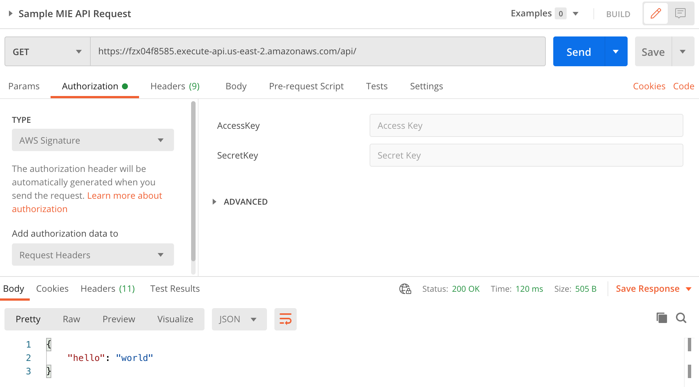

 


Media Insights Engine (MIE) is a development framework for building serverless applications that process video, images, audio, and text  on AWS. MIE takes care of workflow orchestration and data persistence so that you can focus on workflow development. By addressing the concerns of running workflows, MIE empowers you to build applications faster with the benefit of inheriting a pre-built and robust back end.

MIE has been successfully used in a variety of scenarios, such as:

* Deriving video features for ad placement
* Transforming video content with redaction
* Indexing videos based on visual and audio content
* Translating videos for automated localization

For additional details and sample use cases, refer to [How to Rapidly Prototype Multimedia Applications on AWS with the Media Insights Engine](https://aws.amazon.com/blogs/media/how-to-rapidly-prototype-multimedia-applications-on-aws-with-the-media-insights-engine/) on the AWS Media blog.

This repository contains the MIE back-end framework. Users interact with MIE through REST APIs or by invoking MIE Lambda functions directly. You will not find a graphical user interface (GUI) in this repository, but a reference application for MIE that includes a GUI is in the [Media Insights](https://github.com/awslabs/aws-media-insights) repository. 

# Install

You can deploy MIE in your AWS account with the following Cloud Formation templates. **The Cloud Formation stack name must be 12 or fewer characters long**.

Region| Launch
------|-----
US East (N. Virginia) | [](https://console.aws.amazon.com/cloudformation/home?region=us-east-1#/stacks/new?stackName=mie&templateURL=https://rodeolabz-us-east-1.s3.amazonaws.com/aws-media-insights-engine/v3.0.4/media-insights-stack.template)
US West (Oregon) | [](https://console.aws.amazon.com/cloudformation/home?region=us-west-2#/stacks/new?stackName=mie&templateURL=https://rodeolabz-us-west-2.s3.us-west-2.amazonaws.com/aws-media-insights-engine/v3.0.4/media-insights-stack.template)
EU West (Ireland) | [](https://console.aws.amazon.com/cloudformation/home?region=eu-west-1#/stacks/new?stackName=mie&templateURL=https://rodeolabz-eu-west-1.s3.eu-west-1.amazonaws.com/aws-media-insights-engine/v3.0.4/media-insights-stack.template)

The Cloud Formation options for these one-click deploys are described in the [installation parameters](#installation-parameters) section.

## Build from scratch:

Run the following commands to build and deploy MIE from scratch. Be sure to define values for `MIE_STACK_NAME` and `REGION` first.

```
REGION=[specify a region]
MIE_STACK_NAME=[specify a stack name]
git clone https://github.com/awslabs/aws-media-insights-engine
cd aws-media-insights-engine
cd deployment
VERSION=0.0.0
DATETIME=$(date '+%s')
DIST_OUTPUT_BUCKET=media-insights-engine-$DATETIME
aws s3 mb s3://$DIST_OUTPUT_BUCKET-$REGION --region $REGION
aws s3 mb s3://$TEMPLATE_OUTPUT_BUCKET --region $REGION
./build-s3-dist.sh --template-bucket $DIST_OUTPUT_BUCKET --code-bucket $DIST_OUTPUT_BUCKET --version $VERSION --region $REGION
TEMPLATE={copy "Template to deploy" link from output of build script}
aws cloudformation create-stack --stack-name $MIE_STACK_NAME --template-url $TEMPLATE --region $REGION --capabilities CAPABILITY_IAM CAPABILITY_NAMED_IAM CAPABILITY_AUTO_EXPAND --disable-rollback
```

## Outputs

If you're building applications on MIE then you will need to understand the following resources in the **Outputs** tab of the Cloud Formation stack:

* **DataplaneApiEndpoint** is the endpoint for accessing dataplane APIs to create, update, delete and retrieve media assets
* **DataplaneBucket** is the S3 bucket used to store derived media (_derived assets_) and raw analysis metadata created by MIE workflows.
* **WorkflowApiEndpoint** is the endpoint for accessing the Workflow APIs to create, update, delete and execute MIE workflows.
* **WorkflowCustomResourceArn** is the custom resource that can be used to create MIE workflows in CloudFormation scripts

# Cost

You are responsible for the cost of the AWS services used while running this solution. As of April, 2021 the cost for running this solution with the default settings in the us-east-1 (N. Virginia) region is approximately **$24 per month without free tiers**, or **$13 per month with free tiers** for 100 workflow runs. Most MIE use cases are covered by the free tier for all AWS services except Amazon Kinesis and AWS Lambda. The costs for the Amazon Kinesis data stream ($12.56/mo) and the Workflow Scheduler lambda ($3.73/mo) will remain relatively unchanged, regardless of how many workflows execute.

### Approximate monthly cost, excluding all free tiers:

| AWS Service | Quantity | Cost |
| --- | --- | --- |
| Amazon API Gateway | 1 million workflows | $3.50 / mo |
| Amazon Dynamo DB | 1 million workflows | $.025 / mo |
| AWS Lambda | 100 workflows | $4.75 / mo |
| Amazon Kinesis | 100 workflows | $12.56 / mo |
| Amazon SQS | 1 million workflows | $0.40 / mo |
| Amazon SNS | n/a | No charge |
| Amazon S3 | 100 workflows | $2.3 / mo |
| AWS Xray | 100 workflows | $.0005 / mo |

These cost estimates are based on workflows processing live action videos 10 minutes in duration. Each additional 100 workflow executions will cost roughly $2, or higher for videos longer than 10 minutes and lower for videos shorter than 10 minutes.

# Limitations

The Cloud Formation stack name for MIE must be 12 or fewer characters long. This will ensure all the resources in MIE stack remain under the maximum length allowed by Cloud Formation.

MIE does not inherently limit media attributes such as file size or video duration. Those limitations depend on the services used in user-defined workflows. For example, if a workflow uses Amazon Rekognition, then that workflow will be subject to the limitations listed in the [guidelines and quotas for Amazon Rekognition](https://docs.aws.amazon.com/rekognition/latest/dg/limits.html).

# Architecture Overview

Deploying MIE builds the following environment in the AWS Cloud:


The AWS CloudFormation template provisions the following resources:

1. **Resource:** An Amazon API Gateway resource for the control plane REST API
   
   **Execution flow:** This is the entry point where requests to create, read, update, delete (CRUD), or execute workflows begin.

2. **Resource:** AWS Lambda and Amazon Simple Queue Service (Amazon SQS) resources to support workflow orchestration and translating user-defined workflows into AWS Step Functions

   **Execution flow:** Requests for workflow CRUD will finish in this step after an AWS Lambda function updates workflow related tables in DynamoDB. Requests to execute workflows will begin in this step by an AWS Lambda function that saves the request to an SQS queue, which is later read and executed by an AWS Lambda function (called, the workflow scheduler) that controls how many workflows can run at the same time.

3. **Resource:** Amazon DynamoDB tables to store workflow-related data, such as state machine definitions for operators, workflow configurations, and workflow execution status.

4. **Resource:** Step function resources in AWS Step Functions
    
   **Execution flow:** When a user defines a new workflow using the workflow API, then an AWS Lambda function creates an executable step function resource in AWS Step Function. When the workflow scheduler starts a workflow, it starts that step function resource, which then invokes a series of AWS Lambda functions that call external services and/or download results from those services. When all the AWS Lambda functions in a workflow have finished execution, then an AWS Lambda function is called to update the workflow status in Amazon DynamoDB.
   
5. **Resource:** AWS Lambda functions for using the following commonly used services in MIE workflows: Amazon Rekognition, Amazon Comprehend, Amazon Translate, Amazon Transcribe, Amazon Polly, and AWS Elemental MediaConvert
   
   **Execution flow:** Operators consist of AWS Lambda functions that call external services and/or download results from those services. They are invoked by a state machine in AWS Step Functions, as prescribed by the workflow definition. These AWS Lambda functions save results to long-term storage via the data plane REST API.

6. **Resource:** An Amazon API Gateway resource for the data plane REST API

   **Execution flow:** Operators save results to long-term storage by calling this API.

7. **Resource:** Amazon Simple Storage Service (Amazon S3), DynamoDB, and DynamoDB Streams for media and metadata data storage

   **Execution flow:** The AWS Lambda function behind the data plane API directly accesses Amazon S3 and Amazon DynamoDB to perform incoming CRUD requests. That AWS Lambda function saves files, such as binary media files or JSON metadata files, in Amazon S3. A pointer to those files is saved in an Amazon DynamoDB table. Finally, a time-ordered sequence of modifications to that table are saved in an Amazon DynamoDB Stream and an Amazon Kinesis Data stream.

8. **Resource:** An Amazon Kinesis Data stream for interfacing with external applications

   **Execution flow:** The Amazon Kinesis Data Streams provides an interface for external applications to access data stored in the MIE data plane. This interface is appropriate for feeding downstream data stores, such as the Amazon Elasticsearch Service or Amazon Neptune, that support specialized data access patterns required by end-user applications. In order to feed a downstream data store, you must implement a consumer (e.g. an AWS Lambda function) that consumes records from the data stream and performs the necessary extract, transform, and load (ETL) tasks needed for the external application.


> **NOTE:** The ETL tasks that feed downstream data stores are entirely use-case dependent and therefore must be user-defined. The [Implementation Guide](IMPLEMENTATION_GUIDE.md) includes detailed instructions for implementing ETL functions in MIE.

### Architecture components:

* **Workflow API:** Use the workflow API to create, update, delete, execute, and monitor workflows.

* **Control plane:** The control plane includes the workflow API and state machines for workflows. Workflow state machines are composed of operators from the MIE operator library. When operators within the state machine are run, they interact with the MIE data plane to store and retrieve derived asset and metadata generated from the workflow.

  The control plane uses the following Amazon DynamoDB tables store workflow-related data:

  * `Workflow` – This table records user-defined workflows.
  * `Workflow Execution` – This table records the details of every workflow run.
  * `Operations` – This table records details for each operator in the operator library, such as references to Lambda functions and default runtime parameters.
  * `Stage` – This table records the auto-generated AWS Step Functions code needed for each operator.
  * `System` – This table records system-wide configurations, such as maximum concurrent workflows.
      
* **Operators:** Operators are generated state machines that call AWS Lambda functions to perform media analysis or media transformation tasks. Users can define custom operators, but the MIE operator library includes the following pre-built operators:

  * `Celebrity Recognition `- An asynchronous operator to identify celebrities in a video using Amazon Rekognition.
  * `Content Moderation` - An asynchronous operator to identify unsafe content in videos using Amazon Rekognition.
  * `Face Detection` - An asynchronous operator to identify faces in videos using Amazon Rekognition.
  * `Face Search` - An asynchronous operator to identify faces from a custom face collection in videos using Amazon Rekognition.
  * `Label Detection` - An asynchronous operator to identify objects in a video using Amazon Rekognition.
  * `Person Tracking` - An asynchronous operator to identify people in a video using Amazon Rekognition.
  * `Shot Detection` - An asynchronous operator to identify camera shots in a video using Amazon Rekognition.
  * `Text Detection` – An asynchronous operator to identify text in a video using Amazon Rekognition.
  * `Technical Cue Detection` – An asynchronous operator to identify technical cues such as end credits, color bars, and black bars in a video using Amazon Rekognition.
  * `Comprehend Key Phrases` – An asynchronous operator to find key phrases in text using Amazon Comprehend.
  * `Comprehend Entities` – An asynchronous operator to find references to real-world objects, dates, and quantities in text using Amazon Comprehend.
  * `Create SRT Captions` – A synchronous operator to generate SRT formatted caption files from a video transcript generated by Amazon Transcribe.
  * `Create VTT Captions` - A synchronous operator to generate VTT formatted caption files from a video transcript generated by Amazon Transcribe.
  * `Media Convert` - An asynchronous operator to transcode input video into mpeg4 format using AWS Elemental MediaConvert.
  * `Media Info` – A synchronous operator to read technical tag data for video files.
  * `Polly` - An asynchronous operator that turns input text into speech using Amazon Polly.
  * `Thumbnail` - An asynchronous operator that generates thumbnail images for an input video file using AWS Elemental MediaConvert.
  * `Transcribe` - An asynchronous operator to convert input audio to text using Amazon Transcribe.
  * `Translate` - An asynchronous operator to translate input text using Amazon Translate.

* **Data plane:** This stores the media assets and metadata generated by workflows. Implement a consumer of the Kinesis data stream in the data plane to extract, transform, and load (ETL) data from the master MIE data store to downstream databases that support the data access patterns required by end-user applications. 

* **Data plane API:** This API is used to create, update, delete, and retrieve media assets and metadata.

* **Data plane pipeline:** This pipeline stores metadata for an asset that can be retrieved using an object's `AssetId` and `Metadata` type. Writing data to the pipeline initiates a copy of the data to be stored in Kinesis Data Streams. This data stream is the interface that end-user applications can connect to use data stored in the MIE data plane.

* **Data pipeline consumers:** Changes to the data plane DynamoDB table are reflected in an Amazon Kinesis data stream. For each record in that stream, data pipeline consumers perform the necessary extract, transform, and load (ETL) tasks needed to replicate data, such as media metadata, to the data stores used by external applications. These ETL tasks are entirely use-case dependent and therefore must be user-defined. The  [Implementation Guide](IMPLEMENTATION_GUIDE.md) includes detailed instructions for implementing data pipeline consumers.


# Installation Parameters

You can deploy MIE in your AWS account with the [one-click deploy buttons](#install) shown above. 

## Required parameters

**Stack Name**: The name of the stack. **This must be 12 or fewer characters long.**

## Optional parameters

| Parameter | Default | Description |
|---|---|---|
| `MaxConcurrentWorkflows` | `5` | Identifies the maximum number of workflows to run concurrently. When the maximum is reached, additional workflows are added to a wait queue. If too high, then workflows may fail due to external service quotas. Recommended range is 2 to 5. |
| `DeployAnalyticsPipeline` | `true` | Determines whether to deploy a data streaming pipeline that can be consumed by external applications. By default, this capability is activated when the solution is deployed. Set to `false` to deactivate this capability. |
| `DeployTestWorkflow` | `false` | Determines whether to deploy test resources that contain Lambda functions required for integration and end-to-end testing. By default, this capability is deactivated. Set to `true` to activate this capability. |
| `EnableXrayTrace` | `false` | Determines whether to activate Active Xray tracing on all entry points to the stack. By default, this capability is deactivated when the solution is deployed. Set to true to activate this capability. |
| `ExternalBucketArn` | `` | The ARN for Amazon S3 resources that exist outside the MIE stack which may need to be used as inputs to MIE workflows. The ARN must be a valid [Amazon S3 ARN](https://docs.aws.amazon.com/AmazonS3/latest/userguide/s3-arn-format.html) and must reference the same AWS account that is used for the MIE stack. By default, ExternalBucketArn will be blank, meaning workflows will only be able to input media files from the MIE data plane bucket. |

# Developers

Join our Gitter chat at [https://gitter.im/awslabs/aws-media-insights-engine](https://gitter.im/awslabs/aws-media-insights-engine)! This public chat forum was created to foster communication between MIE developers worldwide.

[](https://gitter.im/awslabs/aws-media-insights-engine)

For instructions on how to build applications with MIE, read the API reference and builder's guide in the [Implementation Guide](IMPLEMENTATION_GUIDE.md).

## Security

MIE uses AWS_IAM to authorize REST API requests. The following screenshot shows how to test authentication to the MIE API using Postman. Be sure to specify the `AccessKey` and `SecretKey` for your own AWS environment.



For more information, see the [Implementation Guide](IMPLEMENTATION_GUIDE.md#step-6-test-your-new-workflow-and-operator).

# Uninstall

To uninstall MIE, delete the CloudFormation stack, as described below. This will delete all the resources created by the MIE template except the `Dataplane` and the `DataplaneLogs` S3 buckets. These two buckets are retained when the solution stack is deleted in order to help prevent accidental data loss. You can use either the AWS Management Console or the AWS Command Line Interface (AWS CLI) to empty, then delete those S3 buckets after deleting the CloudFormation stack.

### Option 1: Uninstall using the AWS Management Console
1. Sign in to the AWS CloudFormation console.
2. Select the MIE stack.
3. Choose Delete.

### Option 2: Uninstall using AWS Command Line Interface
```
aws cloudformation delete-stack --stack-name <installation-stack-name> --region <aws-region>
```

### Deleting MIE data buckets
MIE creates two S3 buckets that are not automatically deleted. To delete these buckets, use the steps below.

1. Sign in to the Amazon S3 console.
2. Select the `Dataplane` bucket.
3. Choose Empty.
4. Choose Delete.
5. Select the `DataplaneLogs` bucket.
6. Choose Empty.
7. Choose Delete.
   
To delete the S3 bucket using AWS CLI, run the following command:
```
aws s3 rb s3://<bucket-name> --force
```

## Collection of operational metrics

MIE sends anonymous operational metrics to AWS when it is deployed. We use this data to help improve the quality of the MIE solution. It consists of the following information:

* **Solution ID:** The MIE solution identifier (`SO0163`)
* **Unique ID (UUID):** Randomly generated, unique identifier for each AWS Media Insights Engine deployment
* **Timestamp:** Date and time of the MIE stack deployment
* **Instance Data:** The version of the solution that was deployed

Example data:

```
{
    "Solution": "SO0163",
    "UUID": "d84a0bd5-7483-494e-8ab1-fdfaa7e97687",
    "TimeStamp": "2021-03-01T20:03:05.798545",
    "Data": {
        "Version": "2.0.5",
        "CFTemplate": "Created"
    }
}
```

To opt out of this reporting, set the `SendAnonymousData` parameter in the base Cloud Formation template [deployment/media-insights-stack.yaml](deployment/media-insights-stack.yaml) to a value of `false`.


# Known Issues

Visit the Issue page in this repository for known issues and feature requests.

# Contributing

See the [CONTRIBUTING](CONTRIBUTING.md) file for how to contribute.

# Logo

The [MIE logo](docs/assets/images/MIE_logo.png) features a clapperboard representing *multimedia*, centered inside a crosshair representing *under scrutiny*. 

# License

See the [LICENSE](LICENSE.txt) file for our project's licensing.

Copyright Amazon.com, Inc. or its affiliates. All Rights Reserved.

Unless required by applicable law or agreed to in writing, software distributed under the License is distributed on an "AS IS" BASIS, WITHOUT WARRANTIES OR CONDITIONS OF ANY KIND, either express or implied. 
